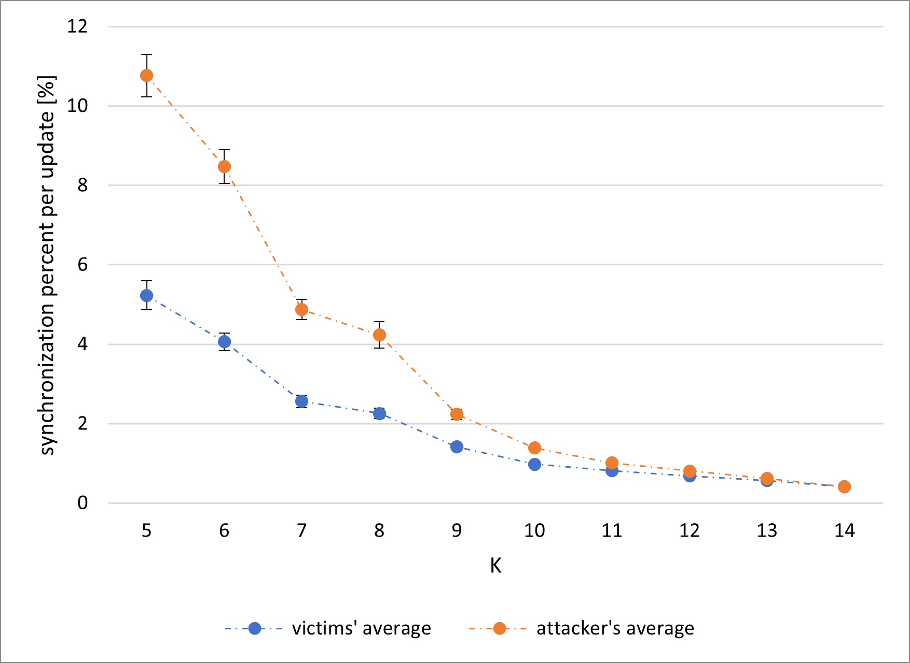

# Scenario 1 results:
## explanation for abbreviations in tables:
| ***abbreviation***      | ***explanation***                                     |
|:-----------------------:|:-----------------------------------------------------:|
| ***`U_V`***             | average number of updates between victims             |
| ***`E``X`*** | average $\pm$ error value for the column `X`          |
| ***`S`***               | average percent of attacker's synchronization         |
| ***`U_A`***             | average number of attacker's updates                  |
| ***`P_V`***             | average victims' synchronization percent per update   |
| ***`P_A`***             | average attacker's synchronization percent per update |

## hebbian, random keys:
### table with results \([legend](scenario_1_results.md#explanation-for-abbreviations-in-tables)\):
| ***`K`*** | ***`U_V`*** | ***`E``U_V`*** | ***`S`*** | ***`E``S`*** | ***`U_A`*** | ***`E``U_A`*** | ***`P_V`*** | ***`E``P_V`*** | ***`P_A`*** | ***`E``P_A`*** |
|:---------:|:-----------:|:-------------------------:|:---------:|:-----------------------:|:-----------:|:-------------------------:|:-----------:|:-------------------------:|:-----------:|:-------------------------:|
| 5         | 358.64      | 11.5                      | 66.52     | 0.46                    | 86.02       | 3.18                      | 0.451       | 0.017                     | 1.416       | 0.059                     |
| 6         | 463.07      | 14.45                     | 65.81     | 0.35                    | 126.89      | 4.45                      | 0.347       | 0.013                     | 0.924       | 0.038                     |
| 7         | 551.91      | 14.99                     | 64.37     | 0.32                    | 170.99      | 5.08                      | 0.254       | 0.008                     | 0.56        | 0.018                     |
| 8         | 721.7       | 16.72                     | 64.66     | 0.27                    | 257.73      | 6.49                      | 0.182       | 0.005                     | 0.347       | 0.01                      |
| 9         | 869.49      | 21.08                     | 64.39     | 0.26                    | 352.12      | 9.22                      | 0.152       | 0.004                     | 0.254       | 0.007                     |
| 10        | 1026.35     | 22.82                     | 63.88     | 0.25                    | 462.51      | 11.04                     | 0.123       | 0.003                     | 0.18        | 0.004                     |
| 11        | 1293.05     | 26.5                      | 63.53     | 0.23                    | 637.52      | 14.11                     | 0.094       | 0.002                     | 0.124       | 0.003                     |
| 12        | 1595.8      | 31.31                     | 63.34     | 0.22                    | 860.72      | 17.81                     | 0.074       | 0.001                     | 0.089       | 0.002                     |
| 13        | 1842.69     | 33.47                     | 62.89     | 0.21                    | 1062.02     | 20.21                     | 0.064       | 0.001                     | 0.071       | 0.001                     |
| 14        | 2191.23     | 37.66                     | 62.98     | 0.2                     | 1350.09     | 24.27                     | 0.053       | 0.001                     | 0.055       | 0.001                     |
### Synchronization percent per update

### Attacker's synchronization and updates

## hebbian, `QBER` = `3%`:
### table with results \([legend](scenario_1_results.md#explanation-for-abbreviations-in-tables)\):
| ***`K`*** | ***`U_V`*** | ***`E``U_V`*** | ***`S`*** | ***`E``S`*** | ***`U_A`*** | ***`E``U_A`*** | ***`P_V`*** | ***`E``P_V`*** | ***`P_A`*** | ***`E``P_A`*** |
|:---------:|:-----------:|:-------------------------:|:---------:|:-----------------------:|:-----------:|:-------------------------:|:-----------:|:-------------------------:|:-----------:|:-------------------------:|
| 5         | 57.06       | 4.25                      | 65.32     | 0.38                    | 15.52       | 1.09                      | 4.716       | 0.237                     | 10.412      | 0.516                     |
| 6         | 71.43       | 5.83                      | 64.56     | 0.33                    | 21.76       | 1.73                      | 4.081       | 0.268                     | 8.956       | 0.506                     |
| 7         | 113.43      | 9.34                      | 64.24     | 0.29                    | 38.82       | 3.21                      | 2.613       | 0.153                     | 5.264       | 0.311                     |
| 8         | 133.69      | 9.84                      | 64.6      | 0.27                    | 53.4        | 3.99                      | 2.28        | 0.117                     | 4.04        | 0.244                     |
| 9         | 208.72      | 14.34                     | 63.95     | 0.24                    | 92.03       | 6.43                      | 1.437       | 0.072                     | 2.323       | 0.17                      |
| 10        | 282.42      | 17.06                     | 64.04     | 0.24                    | 136.87      | 8.35                      | 0.999       | 0.047                     | 1.396       | 0.081                     |
| 11        | 281.47      | 14.98                     | 63.95     | 0.22                    | 149.88      | 8.2                       | 0.904       | 0.043                     | 1.152       | 0.065                     |
| 12        | 390.02      | 17.65                     | 63.67     | 0.22                    | 223.65      | 10.23                     | 0.574       | 0.021                     | 0.66        | 0.027                     |
| 13        | 393.54      | 18.1                      | 63.32     | 0.21                    | 239.95      | 11.21                     | 0.57        | 0.022                     | 0.615       | 0.026                     |
| 14        | 460.05      | 17.81                     | 63.46     | 0.2                     | 297.16      | 11.62                     | 0.442       | 0.018                     | 0.449       | 0.02                      |
### Synchronization percent per update

### Attacker's synchronization and updates

## hebbian, `QBER` = `5%`:
### table with results \([legend](scenario_1_results.md#explanation-for-abbreviations-in-tables)\):
| ***`K`*** | ***`U_V`*** | ***`E``U_V`*** | ***`S`*** | ***`E``S`*** | ***`U_A`*** | ***`E``U_A`*** | ***`P_V`*** | ***`E``P_V`*** | ***`P_A`*** | ***`E``P_A`*** |
|:---------:|:-----------:|:-------------------------:|:---------:|:-----------------------:|:-----------:|:-------------------------:|:-----------:|:-------------------------:|:-----------:|:-------------------------:|
| 5         | 70.41       | 6.26                      | 65.45     | 0.35                    | 19.47       | 2.01                      | 4.57        | 0.292                     | 10.524      | 0.552                     |
| 6         | 72.27       | 7.03                      | 64.19     | 0.32                    | 23.21       | 2.54                      | 4.668       | 0.322                     | 9.546       | 0.567                     |
| 7         | 129.3       | 9.06                      | 64.21     | 0.28                    | 44.82       | 3.19                      | 2.617       | 0.165                     | 5.079       | 0.367                     |
| 8         | 121.17      | 7.73                      | 64.17     | 0.28                    | 48.56       | 3.13                      | 2.28        | 0.15                      | 3.91        | 0.279                     |
| 9         | 189         | 12.2                      | 63.92     | 0.26                    | 83.05       | 5.53                      | 1.495       | 0.065                     | 2.474       | 0.167                     |
| 10        | 280.21      | 16.67                     | 64.25     | 0.24                    | 136.19      | 8.28                      | 1.063       | 0.051                     | 1.488       | 0.081                     |
| 11        | 323.24      | 20.54                     | 63.81     | 0.24                    | 172.62      | 11.22                     | 0.908       | 0.04                      | 1.127       | 0.052                     |
| 12        | 416.99      | 21.96                     | 63.85     | 0.22                    | 238.89      | 12.71                     | 0.638       | 0.031                     | 0.736       | 0.036                     |
| 13        | 457.71      | 23.91                     | 63.34     | 0.2                     | 280.98      | 14.9                      | 0.572       | 0.026                     | 0.62        | 0.032                     |
| 14        | 605.06      | 30.18                     | 63.39     | 0.19                    | 392.28      | 19.73                     | 0.416       | 0.019                     | 0.422       | 0.02                      |
### Synchronization percent per update

### Attacker's synchronization and updates

## hebbian, `QBER` = `7%`:
### table with results \([legend](scenario_1_results.md#explanation-for-abbreviations-in-tables)\):
| ***`K`*** | ***`U_V`*** | ***`E``U_V`*** | ***`S`*** | ***`E``S`*** | ***`U_A`*** | ***`E``U_A`*** | ***`P_V`*** | ***`E``P_V`*** | ***`P_A`*** | ***`E``P_A`*** |
|:---------:|:-----------:|:-------------------------:|:---------:|:-----------------------:|:-----------:|:-------------------------:|:-----------:|:-------------------------:|:-----------:|:-------------------------:|
| 5         | 64.08       | 5.42                      | 65.55     | 0.38                    | 17.97       | 1.86                      | 5.228       | 0.367                     | 10.765      | 0.537                     |
| 6         | 62.75       | 4.83                      | 65.14     | 0.32                    | 19.55       | 1.48                      | 4.059       | 0.225                     | 8.471       | 0.423                     |
| 7         | 103.86      | 7.16                      | 64.45     | 0.29                    | 36.13       | 2.51                      | 2.56        | 0.153                     | 4.876       | 0.252                     |
| 8         | 136.88      | 10.67                     | 64.14     | 0.28                    | 54.09       | 4.23                      | 2.256       | 0.127                     | 4.237       | 0.331                     |
| 9         | 195.05      | 11.65                     | 63.89     | 0.25                    | 85.9        | 5.18                      | 1.41        | 0.065                     | 2.232       | 0.13                      |
| 10        | 279.86      | 15.52                     | 64.36     | 0.23                    | 135.8       | 7.61                      | 0.979       | 0.043                     | 1.39        | 0.077                     |
| 11        | 347.1       | 20.07                     | 63.91     | 0.23                    | 183.45      | 10.75                     | 0.812       | 0.035                     | 1.014       | 0.045                     |
| 12        | 395.51      | 20.84                     | 63.57     | 0.22                    | 225.69      | 12.04                     | 0.684       | 0.031                     | 0.809       | 0.042                     |
| 13        | 465.51      | 23.69                     | 63.81     | 0.21                    | 286.56      | 14.85                     | 0.565       | 0.03                      | 0.623       | 0.041                     |
| 14        | 621.45      | 28.29                     | 63.46     | 0.19                    | 404.58      | 18.63                     | 0.412       | 0.019                     | 0.409       | 0.019                     |
### Synchronization percent per update

### Attacker's synchronization and updates

## randomwalk, random keys:
### table with results \([legend](scenario_1_results.md#explanation-for-abbreviations-in-tables)\):
| ***`K`*** | ***`U_V`*** | ***`E``U_V`*** | ***`S`*** | ***`E``S`*** | ***`U_A`*** | ***`E``U_A`*** | ***`P_V`*** | ***`E``P_V`*** | ***`P_A`*** | ***`E``P_A`*** |
|:---------:|:-----------:|:-------------------------:|:---------:|:-----------------------:|:-----------:|:-------------------------:|:-----------:|:-------------------------:|:-----------:|:-------------------------:|
| 5         | 223.48      | 4.64                      | 69.95     | 0.35                    | 45.73       | 1.03                      | 0.569       | 0.014                     | 2.036       | 0.058                     |
| 6         | 312.59      | 6.13                      | 69.13     | 0.3                     | 73.6        | 1.54                      | 0,4         | 0.011                     | 1,2         | 0.033                     |
| 7         | 428.59      | 7.68                      | 69.07     | 0.28                    | 116.68      | 2.25                      | 0.278       | 0.006                     | 0.729       | 0.019                     |
| 8         | 574.09      | 9.71                      | 68.75     | 0.25                    | 179.25      | 3.22                      | 0.205       | 0.004                     | 0.461       | 0.01                      |
| 9         | 724.11      | 11.43                     | 68.34     | 0.24                    | 258.23      | 4.33                      | 0.158       | 0.003                     | 0.308       | 0.006                     |
| 10        | 887.62      | 13.83                     | 68.14     | 0.22                    | 353.43      | 5.75                      | 0.127       | 0.002                     | 0.221       | 0.004                     |
| 11        | 1072.06     | 15.5                      | 67.97     | 0.22                    | 473.92      | 7.06                      | 0.104       | 0.002                     | 0.16        | 0.003                     |
| 12        | 1234.2      | 16.18                     | 67.64     | 0.2                     | 595.42      | 8.15                      | 0.089       | 0.001                     | 0.126       | 0.002                     |
| 13        | 1475.39     | 19.88                     | 67.35     | 0.2                     | 773.15      | 10.74                     | 0.074       | 0.001                     | 0.096       | 0.001                     |
| 14        | 1689.26     | 22.33                     | 67.63     | 0.18                    | 952.33      | 13.15                     | 0.065       | 0.001                     | 0.078       | 0.001                     |
### Synchronization percent per update

### Attacker's synchronization and updates

## randomwalk, `QBER` = `3%`:
### table with results \([legend](scenario_1_results.md#explanation-for-abbreviations-in-tables)\):
| ***`K`*** | ***`U_V`*** | ***`E``U_V`*** | ***`S`*** | ***`E``S`*** | ***`U_A`*** | ***`E``U_A`*** | ***`P_V`*** | ***`E``P_V`*** | ***`P_A`*** | ***`E``P_A`*** |
|:---------:|:-----------:|:-------------------------:|:---------:|:-----------------------:|:-----------:|:-------------------------:|:-----------:|:-------------------------:|:-----------:|:-------------------------:|
| 5         | 92.34       | 3.23                      | 69.43     | 0.32                    | 23.48       | 0.81                      | 2.986       | 0.35                      | 6.624       | 0.423                     |
| 6         | 127.48      | 4.32                      | 68.88     | 0.28                    | 36.35       | 1.26                      | 1.878       | 0.146                     | 4.51        | 0.364                     |
| 7         | 205.78      | 6.15                      | 68.58     | 0.27                    | 65.2        | 1.95                      | 0.91        | 0.063                     | 2.538       | 0.208                     |
| 8         | 259.32      | 7.23                      | 68.32     | 0.26                    | 93.33       | 2.6                       | 0.657       | 0.055                     | 1.605       | 0.178                     |
| 9         | 363.81      | 9.57                      | 68.36     | 0.23                    | 144.86      | 3.84                      | 0.444       | 0.023                     | 0.776       | 0.047                     |
| 10        | 472.63      | 11.05                     | 68.06     | 0.23                    | 207.01      | 4.97                      | 0.297       | 0.011                     | 0.465       | 0.016                     |
| 11        | 582.45      | 13.48                     | 67.76     | 0.23                    | 279.59      | 6.56                      | 0.26        | 0.014                     | 0.374       | 0.022                     |
| 12        | 721.23      | 15.51                     | 67.36     | 0.21                    | 373.88      | 8.1                       | 0.183       | 0.006                     | 0.239       | 0.008                     |
| 13        | 836.43      | 17.76                     | 67.47     | 0.2                     | 465.43      | 9.94                      | 0.163       | 0.007                     | 0.199       | 0.008                     |
| 14        | 1022.69     | 20.12                     | 67.66     | 0.18                    | 605         | 12.11                     | 0.12        | 0.003                     | 0.137       | 0.003                     |
### Synchronization percent per update

### Attacker's synchronization and updates

## randomwalk, `QBER` = `5%`:
### table with results \([legend](scenario_1_results.md#explanation-for-abbreviations-in-tables)\):
| ***`K`*** | ***`U_V`*** | ***`E``U_V`*** | ***`S`*** | ***`E``S`*** | ***`U_A`*** | ***`E``U_A`*** | ***`P_V`*** | ***`E``P_V`*** | ***`P_A`*** | ***`E``P_A`*** |
|:---------:|:-----------:|:-------------------------:|:---------:|:-----------------------:|:-----------:|:-------------------------:|:-----------:|:-------------------------:|:-----------:|:-------------------------:|
| 5         | 103.65      | 3.24                      | 69.89     | 0.32                    | 26.23       | 0.81                      | 2.252       | 0.244                     | 5.319       | 0.373                     |
| 6         | 130.54      | 4.51                      | 68.77     | 0.29                    | 37.45       | 1.29                      | 1.531       | 0.185                     | 4.049       | 0.352                     |
| 7         | 194.96      | 5.65                      | 68.63     | 0.27                    | 62.06       | 1.82                      | 1.082       | 0.095                     | 2.383       | 0.226                     |
| 8         | 253.86      | 7.1                       | 68.3      | 0.25                    | 91.73       | 2.59                      | 0.744       | 0.075                     | 1.29        | 0.075                     |
| 9         | 366.2       | 9.04                      | 68.11     | 0.25                    | 145.63      | 3.65                      | 0.414       | 0.018                     | 0.716       | 0.032                     |
| 10        | 485.03      | 11.86                     | 67.9      | 0.22                    | 211.57      | 5.21                      | 0.315       | 0.018                     | 0.52        | 0.049                     |
| 11        | 562.09      | 13.39                     | 67.66     | 0.2                     | 269.59      | 6.55                      | 0.265       | 0.014                     | 0.38        | 0.021                     |
| 12        | 740.91      | 15.54                     | 67.66     | 0.2                     | 384.25      | 8.17                      | 0.177       | 0.005                     | 0.231       | 0.007                     |
| 13        | 835.69      | 18.52                     | 67.39     | 0.2                     | 465.63      | 10.42                     | 0.161       | 0.005                     | 0.195       | 0.006                     |
| 14        | 1020.46     | 20.6                      | 67.27     | 0.19                    | 605.51      | 12.37                     | 0.122       | 0.003                     | 0.139       | 0.003                     |
### Synchronization percent per update

### Attacker's synchronization and updates

## randomwalk, `QBER` = `7%`:
### table with results \([legend](scenario_1_results.md#explanation-for-abbreviations-in-tables)\):
| ***`K`*** | ***`U_V`*** | ***`E``U_V`*** | ***`S`*** | ***`E``S`*** | ***`U_A`*** | ***`E``U_A`*** | ***`P_V`*** | ***`E``P_V`*** | ***`P_A`*** | ***`E``P_A`*** |
|:---------:|:-----------:|:-------------------------:|:---------:|:-----------------------:|:-----------:|:-------------------------:|:-----------:|:-------------------------:|:-----------:|:-------------------------:|
| 5         | 99.06       | 3.27                      | 69.45     | 0.34                    | 25.07       | 0.82                      | 2.321       | 0.138                     | 6.475       | 0.446                     |
| 6         | 126.62      | 4.25                      | 69.23     | 0.3                     | 36.34       | 1.2                       | 1.64        | 0.236                     | 4.184       | 0.288                     |
| 7         | 196.31      | 6.01                      | 69.01     | 0.28                    | 62.47       | 1.89                      | 1.048       | 0.073                     | 2.405       | 0.224                     |
| 8         | 244.47      | 7.15                      | 68.37     | 0.26                    | 88.38       | 2.58                      | 0.818       | 0.064                     | 1.544       | 0.119                     |
| 9         | 350.23      | 9.16                      | 68.19     | 0.24                    | 139.88      | 3.69                      | 0.475       | 0.032                     | 0.843       | 0.07                      |
| 10        | 466.34      | 10.67                     | 68.07     | 0.22                    | 203.38      | 4.71                      | 0.351       | 0.026                     | 0.558       | 0.044                     |
| 11        | 577         | 13.13                     | 67.84     | 0.21                    | 277.14      | 6.42                      | 0.233       | 0.009                     | 0.334       | 0.017                     |
| 12        | 703.6       | 14.46                     | 67.71     | 0.2                     | 363.36      | 7.5                       | 0.185       | 0.006                     | 0.243       | 0.008                     |
| 13        | 836.64      | 17.33                     | 67.56     | 0.19                    | 468.28      | 9.85                      | 0.156       | 0.006                     | 0.189       | 0.006                     |
| 14        | 1028.15     | 19.94                     | 67.33     | 0.19                    | 607.7       | 11.94                     | 0.121       | 0.003                     | 0.138       | 0.004                     |

### Synchronization percent per update

### Attacker's synchronization and updates

