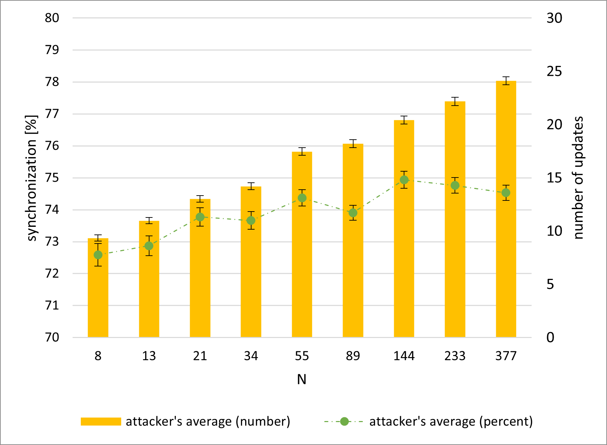

# Scenario 2 results for `K` = `3`:
## explanation for abbreviations in tables:
| ***abbreviation***      | ***explanation***                                     |
|:-----------------------:|:-----------------------------------------------------:|
| ***`U_V`***             | average number of updates between victims             |
| ***`E``X`*** | average $\pm$ error value for the column `X`          |
| ***`S`***               | average percent of attacker's synchronization         |
| ***`U_A`***             | average number of attacker's updates                  |
| ***`P_V`***             | average victims' synchronization percent per update   |
| ***`P_A`***             | average attacker's synchronization percent per update |

## hebbian, random keys:
### table with results \([legend](scenario_2_results_k3.md#explanation-for-abbreviations-in-tables)\):
| ***`N`*** | ***`U_V`*** | ***`E``U_V`*** | ***`S`*** | ***`E``S`*** | ***`U_A`*** | ***`E``U_A`*** | ***`P_V`*** | ***`E``P_V`*** | ***`P_A`*** | ***`E``P_A`*** |
|:---------:|:-----------:|:-------------------------:|:---------:|:-----------------------:|:-----------:|:-------------------------:|:-----------:|:-------------------------:|:-----------:|:-------------------------:|
| 8         | 83.57       | 2.58                      | 71.73     | 0.53                    | 19.5        | 0.56                      | 1.423       | 0.037                     | 5.306       | 0.203                     |
| 13        | 85.01       | 1.98                      | 72.57     | 0.46                    | 20.01       | 0.43                      | 1.455       | 0.035                     | 4.684       | 0.164                     |
| 21        | 86.03       | 1.77                      | 73.34     | 0.41                    | 21.61       | 0.43                      | 1.433       | 0.032                     | 4,1         | 0.086                     |
| 34        | 89.64       | 1.56                      | 73.12     | 0.36                    | 23.17       | 0.38                      | 1.281       | 0.021                     | 3.561       | 0.06                      |
| 55        | 91.13       | 1.54                      | 73.93     | 0.33                    | 25.75       | 0.42                      | 1.251       | 0.02                      | 3.243       | 0.053                     |
| 89        | 90.79       | 1.41                      | 73.73     | 0.3                     | 27.27       | 0.42                      | 1.228       | 0.018                     | 2.997       | 0.043                     |
| 144       | 92.11       | 1.29                      | 74.03     | 0.31                    | 29.23       | 0.41                      | 1.189       | 0.016                     | 2.769       | 0.04                      |
| 233       | 91.38       | 1.3                       | 74.07     | 0.29                    | 30.38       | 0.43                      | 1.198       | 0.016                     | 2.662       | 0.035                     |
| 377       | 99.54       | 1.39                      | 74.15     | 0.27                    | 33.48       | 0.43                      | 1.096       | 0.014                     | 2.388       | 0.03                      |
### Synchronization percent per update

### Attacker's synchronization and updates

## hebbian, `QBER` = `3%`:
### table with results \([legend](scenario_2_results_k3.md#explanation-for-abbreviations-in-tables)\):
| ***`N`*** | ***`U_V`*** | ***`E``U_V`*** | ***`S`*** | ***`E``S`*** | ***`U_A`*** | ***`E``U_A`*** | ***`P_V`*** | ***`E``P_V`*** | ***`P_A`*** | ***`E``P_A`*** |
|:---------:|:-----------:|:-------------------------:|:---------:|:-----------------------:|:-----------:|:-------------------------:|:-----------:|:-------------------------:|:-----------:|:-------------------------:|
| 8         | 22.17       | 0.71                      | 67.69     | 0.38                    | 6.06        | 0.2                       | 8.07        | 0.469                     | 17.252      | 0.702                     |
| 13        | 25.71       | 0.78                      | 69.41     | 0.35                    | 7.55        | 0.22                      | 5.531       | 0.182                     | 13.703      | 0.496                     |
| 21        | 31.72       | 0.83                      | 71.45     | 0.36                    | 10.06       | 0.27                      | 4.159       | 0.104                     | 10.224      | 0.368                     |
| 34        | 38.66       | 1.02                      | 72.63     | 0.33                    | 12.74       | 0.29                      | 3.328       | 0.072                     | 7.456       | 0.207                     |
| 55        | 40.71       | 0.86                      | 73.15     | 0.32                    | 14.14       | 0.3                       | 2.925       | 0.054                     | 6,4         | 0.15                      |
| 89        | 46.16       | 0.93                      | 73.29     | 0.28                    | 16.41       | 0.31                      | 2.531       | 0.042                     | 5.264       | 0.104                     |
| 144       | 48.4        | 0.92                      | 73.39     | 0.27                    | 18.11       | 0.31                      | 2.377       | 0.039                     | 4.64        | 0.082                     |
| 233       | 54.33       | 1.05                      | 74.14     | 0.27                    | 21.02       | 0.38                      | 2.121       | 0.033                     | 4.075       | 0.072                     |
| 377       | 58.2        | 1.16                      | 74.23     | 0.28                    | 22.84       | 0.4                       | 1.963       | 0.029                     | 3.713       | 0.063                     |
### Synchronization percent per update

### Attacker's synchronization and updates

## hebbian, `QBER` = `5%`:
### table with results \([legend](scenario_2_results_k3.md#explanation-for-abbreviations-in-tables)\):
| ***`N`*** | ***`U_V`*** | ***`E``U_V`*** | ***`S`*** | ***`E``S`*** | ***`U_A`*** | ***`E``U_A`*** | ***`P_V`*** | ***`E``P_V`*** | ***`P_A`*** | ***`E``P_A`*** |
|:---------:|:-----------:|:-------------------------:|:---------:|:-----------------------:|:-----------:|:-------------------------:|:-----------:|:-------------------------:|:-----------:|:-------------------------:|
| 8         | 22.31       | 0.84                      | 68.14     | 0.42                    | 6.06        | 0.22                      | 8.268       | 0.469                     | 18.625      | 0.733                     |
| 13        | 24.73       | 0.71                      | 69.12     | 0.35                    | 7.41        | 0.22                      | 5.747       | 0.181                     | 14.014      | 0.55                      |
| 21        | 32.42       | 0.87                      | 71.1      | 0.35                    | 9.91        | 0.26                      | 4.089       | 0.115                     | 9.92        | 0.317                     |
| 34        | 37.85       | 0.88                      | 72.06     | 0.32                    | 12.36       | 0.27                      | 3.269       | 0.067                     | 7.343       | 0.174                     |
| 55        | 41.7        | 0.87                      | 73.11     | 0.31                    | 14.46       | 0.31                      | 2.878       | 0.055                     | 6.193       | 0.132                     |
| 89        | 45.45       | 0.94                      | 74.01     | 0.31                    | 16.34       | 0.32                      | 2.578       | 0.043                     | 5.37        | 0.103                     |
| 144       | 51.11       | 1.03                      | 74.44     | 0.28                    | 19          | 0.36                      | 2.289       | 0.038                     | 4.575       | 0.085                     |
| 233       | 53.66       | 0.92                      | 74.5      | 0.29                    | 20.68       | 0.35                      | 2.105       | 0.031                     | 4.073       | 0.065                     |
| 377       | 58.22       | 1.02                      | 74.5      | 0.29                    | 22.75       | 0.4                       | 1.938       | 0.028                     | 3.708       | 0.059                     |
### Synchronization percent per update

### Attacker's synchronization and updates

## hebbian, `QBER` = `7%`:
### table with results \([legend](scenario_2_results_k3.md#explanation-for-abbreviations-in-tables)\):
| ***`N`*** | ***`U_V`*** | ***`E``U_V`*** | ***`S`*** | ***`E``S`*** | ***`U_A`*** | ***`E``U_A`*** | ***`P_V`*** | ***`E``P_V`*** | ***`P_A`*** | ***`E``P_A`*** |
|:---------:|:-----------:|:-------------------------:|:---------:|:-----------------------:|:-----------:|:-------------------------:|:-----------:|:-------------------------:|:-----------:|:-------------------------:|
| 8         | 22.58       | 0.94                      | 67.35     | 0.4                     | 6.22        | 0.28                      | 7.669       | 0.411                     | 18.015      | 0.716                     |
| 13        | 25.38       | 0.7                       | 69.7      | 0.38                    | 7.55        | 0.2                       | 5.677       | 0.246                     | 13.621      | 0.47                      |
| 21        | 32.44       | 0.93                      | 71.01     | 0.32                    | 9.98        | 0.28                      | 4.19        | 0.104                     | 10,2        | 0.339                     |
| 34        | 39.04       | 0.99                      | 72.67     | 0.33                    | 12.8        | 0.3                       | 3.313       | 0.085                     | 7.481       | 0.23                      |
| 55        | 42.15       | 0.92                      | 72.95     | 0.32                    | 14.48       | 0.33                      | 2.867       | 0.056                     | 6.396       | 0.166                     |
| 89        | 47.54       | 1                         | 73.94     | 0.31                    | 17.2        | 0.34                      | 2.493       | 0.043                     | 5.101       | 0.098                     |
| 144       | 49.73       | 0.97                      | 74.15     | 0.28                    | 18.63       | 0.32                      | 2.316       | 0.037                     | 4.566       | 0.085                     |
| 233       | 55.42       | 1.07                      | 74.29     | 0.29                    | 21.01       | 0.38                      | 2.077       | 0.032                     | 4.091       | 0.073                     |
| 377       | 58.51       | 1.1                       | 74.34     | 0.28                    | 23.11       | 0.4                       | 1.945       | 0.028                     | 3.671       | 0.061                     |
### Synchronization percent per update

### Attacker's synchronization and updates

## randomwalk, random keys:
### table with results \([legend](scenario_2_results_k3.md#explanation-for-abbreviations-in-tables)\):
| ***`N`*** | ***`U_V`*** | ***`E``U_V`*** | ***`S`*** | ***`E``S`*** | ***`U_A`*** | ***`E``U_A`*** | ***`P_V`*** | ***`E``P_V`*** | ***`P_A`*** | ***`E``P_A`*** |
|:---------:|:-----------:|:-------------------------:|:---------:|:-----------------------:|:-----------:|:-------------------------:|:-----------:|:-------------------------:|:-----------:|:-------------------------:|
| 8         | 86.84       | 1.73                      | 73.57     | 0.41                    | 18.39       | 0.39                      | 1.404       | 0.031                     | 5.109       | 0.144                     |
| 13        | 86.69       | 1.57                      | 74.62     | 0.36                    | 20.37       | 0.39                      | 1.36        | 0.026                     | 4.449       | 0.112                     |
| 21        | 86.41       | 1.48                      | 74.03     | 0.32                    | 21.71       | 0.37                      | 1.332       | 0.023                     | 3.943       | 0.073                     |
| 34        | 89.58       | 1.39                      | 74.06     | 0.29                    | 24.32       | 0.39                      | 1.248       | 0.019                     | 3.426       | 0.056                     |
| 55        | 88.41       | 1.27                      | 74.31     | 0.3                     | 25.82       | 0.39                      | 1.248       | 0.018                     | 3.222       | 0.052                     |
| 89        | 95.62       | 1.57                      | 74.64     | 0.27                    | 29.46       | 0.47                      | 1.168       | 0.017                     | 2.813       | 0.04                      |
| 144       | 95.18       | 1.33                      | 74.75     | 0.25                    | 30.65       | 0.44                      | 1.153       | 0.016                     | 2.684       | 0.038                     |
| 233       | 95.63       | 1.37                      | 74.96     | 0.29                    | 32.04       | 0.43                      | 1.14        | 0.014                     | 2.544       | 0.033                     |
| 377       | 100.26      | 1.42                      | 75.33     | 0.28                    | 34.85       | 0.48                      | 1.094       | 0.015                     | 2.371       | 0.034                     |
### Synchronization percent per update

### Attacker's synchronization and updates

## randomwalk, `QBER` = `3%`:
### table with results \([legend](scenario_2_results_k3.md#explanation-for-abbreviations-in-tables)\):
| ***`N`*** | ***`U_V`*** | ***`E``U_V`*** | ***`S`*** | ***`E``S`*** | ***`U_A`*** | ***`E``U_A`*** | ***`P_V`*** | ***`E``P_V`*** | ***`P_A`*** | ***`E``P_A`*** |
|:---------:|:-----------:|:-------------------------:|:---------:|:-----------------------:|:-----------:|:-------------------------:|:-----------:|:-------------------------:|:-----------:|:-------------------------:|
| 8         | 35.43       | 1.23                      | 72.39     | 0.38                    | 9.78        | 0.35                      | 5.383       | 0.268                     | 13.671      | 0.639                     |
| 13        | 36.13       | 1.07                      | 72.93     | 0.34                    | 10.44       | 0.29                      | 4.286       | 0.159                     | 10.821      | 0.428                     |
| 21        | 41.57       | 0.98                      | 73.65     | 0.28                    | 13.23       | 0.32                      | 3.175       | 0.081                     | 7.635       | 0.246                     |
| 34        | 45.74       | 1.09                      | 73.78     | 0.27                    | 14.77       | 0.34                      | 2.777       | 0.061                     | 6.567       | 0.205                     |
| 55        | 46.48       | 0.96                      | 74.4      | 0.27                    | 16.08       | 0.33                      | 2.577       | 0.048                     | 5.56        | 0.111                     |
| 89        | 52.36       | 1.14                      | 74.74     | 0.27                    | 18.68       | 0.38                      | 2.272       | 0.039                     | 4.803       | 0.096                     |
| 144       | 55.51       | 1.1                       | 74.77     | 0.27                    | 20.91       | 0.41                      | 2.123       | 0.037                     | 4.219       | 0.077                     |
| 233       | 58.5        | 1.1                       | 74.19     | 0.24                    | 22.07       | 0.39                      | 1.964       | 0.031                     | 3.889       | 0.072                     |
| 377       | 61.71       | 1.1                       | 74.69     | 0.26                    | 24.25       | 0.41                      | 1.836       | 0.027                     | 3.484       | 0.053                     |
### Synchronization percent per update

### Attacker's synchronization and updates

## randomwalk, `QBER` = `5%`:
### table with results \([legend](scenario_2_results_k3.md#explanation-for-abbreviations-in-tables)\):
| ***`N`*** | ***`U_V`*** | ***`E``U_V`*** | ***`S`*** | ***`E``S`*** | ***`U_A`*** | ***`E``U_A`*** | ***`P_V`*** | ***`E``P_V`*** | ***`P_A`*** | ***`E``P_A`*** |
|:---------:|:-----------:|:-------------------------:|:---------:|:-----------------------:|:-----------:|:-------------------------:|:-----------:|:-------------------------:|:-----------:|:-------------------------:|
| 8         | 34.13       | 1.12                      | 72.27     | 0.37                    | 8.82        | 0.29                      | 5.328       | 0.292                     | 14.199      | 0.636                     |
| 13        | 34.97       | 1.01                      | 73.42     | 0.32                    | 10.4        | 0.3                       | 4.433       | 0.236                     | 11.287      | 0.456                     |
| 21        | 41.72       | 1.08                      | 73.81     | 0.31                    | 12.87       | 0.32                      | 3.248       | 0.103                     | 7.948       | 0.278                     |
| 34        | 45.39       | 1.08                      | 74.33     | 0.28                    | 14.58       | 0.32                      | 2.783       | 0.058                     | 6.524       | 0.17                      |
| 55        | 47.52       | 1.01                      | 74.29     | 0.27                    | 16.51       | 0.33                      | 2.515       | 0.045                     | 5.432       | 0.112                     |
| 89        | 51.47       | 0.97                      | 74.39     | 0.26                    | 18.52       | 0.35                      | 2.257       | 0.037                     | 4.748       | 0.095                     |
| 144       | 54.02       | 1.02                      | 74.17     | 0.24                    | 20.2        | 0.34                      | 2.126       | 0.032                     | 4.197       | 0.069                     |
| 233       | 57.6        | 1.04                      | 74.49     | 0.25                    | 22          | 0.36                      | 1.992       | 0.032                     | 3.851       | 0.066                     |
| 377       | 62.08       | 1.1                       | 74.99     | 0.26                    | 24.38       | 0.39                      | 1.821       | 0.026                     | 3.456       | 0.055                     |
### Synchronization percent per update

### Attacker's synchronization and updates

## randomwalk, `QBER` = `7%`:
### table with results \([legend](scenario_2_results_k3.md#explanation-for-abbreviations-in-tables)\):
| ***`N`*** | ***`U_V`*** | ***`E``U_V`*** | ***`S`*** | ***`E``S`*** | ***`U_A`*** | ***`E``U_A`*** | ***`P_V`*** | ***`E``P_V`*** | ***`P_A`*** | ***`E``P_A`*** |
|:---------:|:-----------:|:-------------------------:|:---------:|:-----------------------:|:-----------:|:-------------------------:|:-----------:|:-------------------------:|:-----------:|:-------------------------:|
| 8         | 35.23       | 1.16                      | 72.59     | 0.35                    | 9.34        | 0.3                       | 5.143       | 0.24                      | 14.464      | 0.668                     |
| 13        | 37.86       | 1.1                       | 72.87     | 0.31                    | 10.97       | 0.31                      | 3.927       | 0.124                     | 9.885       | 0.335                     |
| 21        | 41.17       | 1.07                      | 73.78     | 0.29                    | 13.02       | 0.32                      | 3.248       | 0.083                     | 7.563       | 0.201                     |
| 34        | 44.43       | 1.04                      | 73.66     | 0.28                    | 14.2        | 0.32                      | 2.852       | 0.062                     | 6,7         | 0.171                     |
| 55        | 50.5        | 1.09                      | 74.37     | 0.26                    | 17.46       | 0.36                      | 2.436       | 0.05                      | 5.207       | 0.112                     |
| 89        | 50.64       | 1.07                      | 73.9      | 0.24                    | 18.2        | 0.37                      | 2.34        | 0.041                     | 4.907       | 0.101                     |
| 144       | 53.62       | 1.03                      | 74.94     | 0.27                    | 20.43       | 0.38                      | 2.163       | 0.035                     | 4.327       | 0.084                     |
| 233       | 58.08       | 1.15                      | 74.76     | 0.24                    | 22.18       | 0.39                      | 2.004       | 0.033                     | 3.863       | 0.063                     |
| 377       | 61.29       | 1.04                      | 74.53     | 0.24                    | 24.11       | 0.38                      | 1.839       | 0.027                     | 3.487       | 0.057                     |
### Synchronization percent per update

### Attacker's synchronization and updates

