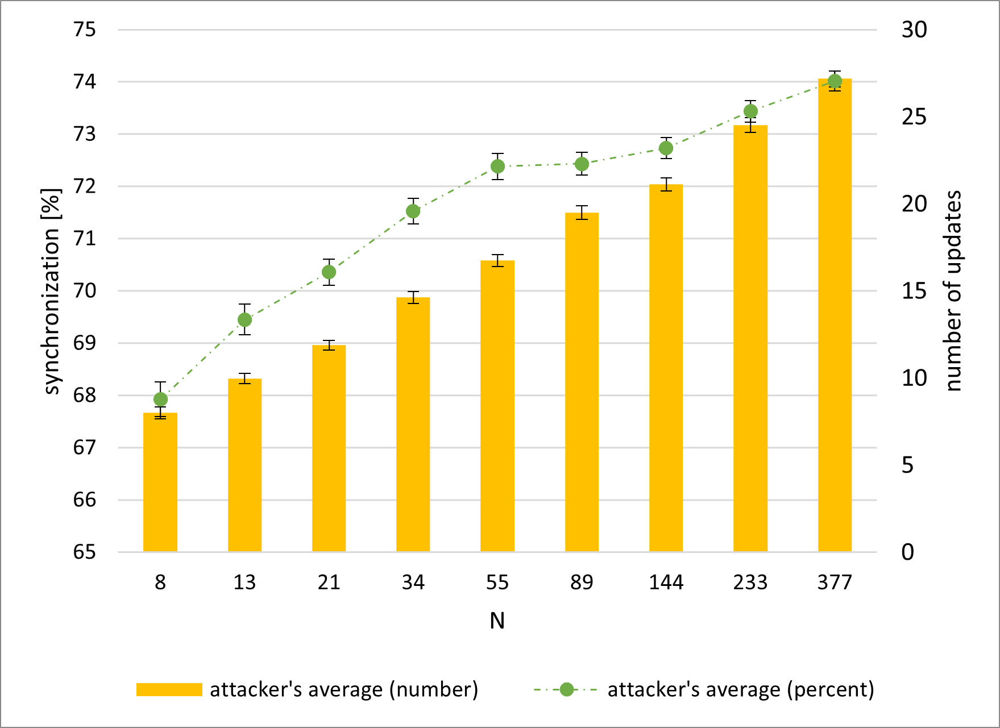
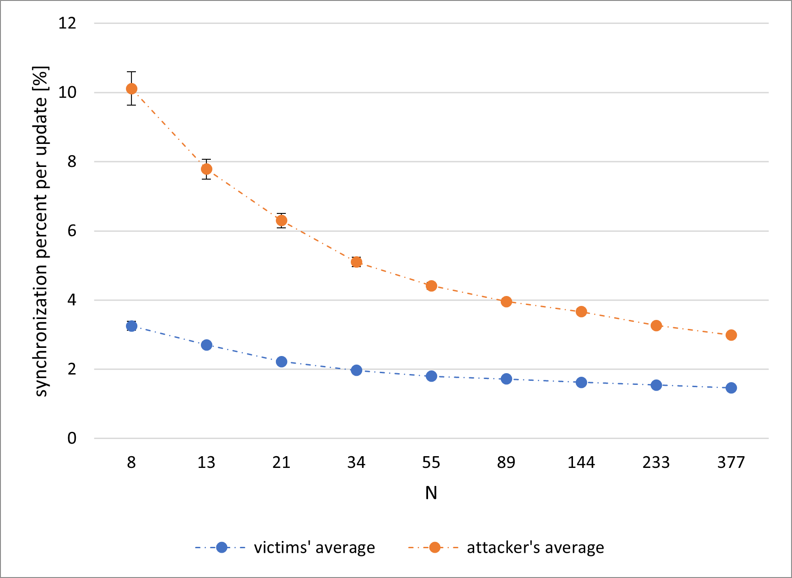

# Scenario 2 results for `K` = `4`:
## explanation for abbreviations in tables:
| ***abbreviation***      | ***explanation***                                     |
|:-----------------------:|:-----------------------------------------------------:|
| ***`U_V`***             | average number of updates between victims             |
| ***`E``X`*** | average $\pm$ error value for the column `X`          |
| ***`S`***               | average percent of attacker's synchronization         |
| ***`U_A`***             | average number of attacker's updates                  |
| ***`P_V`***             | average victims' synchronization percent per update   |
| ***`P_A`***             | average attacker's synchronization percent per update |

## hebbian, random keys:
### table with results \([legend](scenario_2_results_k4.md#explanation-for-abbreviations-in-tables)\):
| ***`N`*** | ***`U_V`*** | ***`E``U_V`*** | ***`S`*** | ***`E``S`*** | ***`U_A`*** | ***`E``U_A`*** | ***`P_V`*** | ***`E``P_V`*** | ***`P_A`*** | ***`E``P_A`*** |
|-----------|-------------|---------------------------|-----------|-------------------------|-------------|---------------------------|-------------|---------------------------|-------------|---------------------------|
| 8         | 111.66      | 3.29                      | 68.51     | 0.35                    | 22          | 0.58                      | 0.962       | 0.022                     | 3.929       | 0.143                     |
| 13        | 113.83      | 2.44                      | 70.52     | 0.3                     | 22.99       | 0.45                      | 1.01        | 0.021                     | 3.705       | 0.081                     |
| 21        | 116.67      | 2.01                      | 71.26     | 0.26                    | 23.27       | 0.39                      | 1.045       | 0.019                     | 3.506       | 0.062                     |
| 34        | 119.73      | 1.92                      | 71.81     | 0.25                    | 25.99       | 0.43                      | 1.002       | 0.017                     | 3.136       | 0.052                     |
| 55        | 120.68      | 1.79                      | 72.49     | 0.24                    | 28.73       | 0.44                      | 0.96        | 0.015                     | 2.808       | 0.042                     |
| 89        | 121.63      | 1.99                      | 72.85     | 0.22                    | 31.82       | 0.48                      | 0.915       | 0.014                     | 2.548       | 0.039                     |
| 144       | 122.99      | 1.68                      | 73.16     | 0.22                    | 33.34       | 0.43                      | 0.919       | 0.013                     | 2.391       | 0.034                     |
| 233       | 127.17      | 1.87                      | 73.02     | 0.21                    | 35.41       | 0.49                      | 0.917       | 0.014                     | 2.265       | 0.033                     |
| 377       | 134.57      | 1.9                       | 73.5      | 0.2                     | 38.42       | 0.52                      | 0.867       | 0.012                     | 2.085       | 0.028                     |
### Synchronization percent per update

### Attacker's synchronization and updates

## hebbian, `QBER` = `3%`:
### table with results \([legend](scenario_2_results_k4.md#explanation-for-abbreviations-in-tables)\):
| ***`N`*** | ***`U_V`*** | ***`E``U_V`*** | ***`S`*** | ***`E``S`*** | ***`U_A`*** | ***`E``U_A`*** | ***`P_V`*** | ***`E``P_V`*** | ***`P_A`*** | ***`E``P_A`*** |
|-----------|-------------|---------------------------|-----------|-------------------------|-------------|---------------------------|-------------|---------------------------|-------------|---------------------------|
| 8         | 29.74       | 1.35                      | 67.45     | 0.32                    | 7.79        | 0.27                      | 5.252       | 0.206                     | 13.898      | 0.545                     |
| 13        | 38.07       | 1.26                      | 68.81     | 0.3                     | 9.68        | 0.28                      | 3.827       | 0.118                     | 11.099      | 0.459                     |
| 21        | 44.25       | 1.17                      | 70.63     | 0.26                    | 11.88       | 0.29                      | 3.028       | 0.08                      | 8.186       | 0.261                     |
| 34        | 50.31       | 1.37                      | 71.02     | 0.24                    | 14.04       | 0.32                      | 2.53        | 0.052                     | 6.367       | 0.148                     |
| 55        | 55.59       | 1.33                      | 71.99     | 0.23                    | 16.96       | 0.35                      | 2.236       | 0.045                     | 5.163       | 0.107                     |
| 89        | 61.87       | 1.36                      | 72.56     | 0.21                    | 19.44       | 0.37                      | 1.952       | 0.036                     | 4.426       | 0.087                     |
| 144       | 66.09       | 1.4                       | 72.82     | 0.21                    | 21.65       | 0.4                       | 1.83        | 0.034                     | 3.953       | 0.074                     |
| 233       | 69.75       | 1.51                      | 73.11     | 0.2                     | 23.67       | 0.41                      | 1.694       | 0.028                     | 3.532       | 0.059                     |
| 377       | 74.38       | 1.64                      | 73.4      | 0.19                    | 27.1        | 0.46                      | 1.532       | 0.026                     | 3.071       | 0.048                     |
### Synchronization percent per update

### Attacker's synchronization and updates

## hebbian, `QBER` = `5%`:
### table with results \([legend](scenario_2_results_k4.md#explanation-for-abbreviations-in-tables)\):
| ***`N`*** | ***`U_V`*** | ***`E``U_V`*** | ***`S`*** | ***`E``S`*** | ***`U_A`*** | ***`E``U_A`*** | ***`P_V`*** | ***`E``P_V`*** | ***`P_A`*** | ***`E``P_A`*** |
|-----------|-------------|---------------------------|-----------|-------------------------|-------------|---------------------------|-------------|---------------------------|-------------|---------------------------|
| 8         | 32.48       | 1.13                      | 68.01     | 0.34                    | 7.21        | 0.23                      | 5.309       | 0.215                     | 14.455      | 0.554                     |
| 13        | 35.06       | 1.11                      | 68.71     | 0.27                    | 8.94        | 0.25                      | 3.969       | 0.107                     | 11.165      | 0,4                       |
| 21        | 44.75       | 1.32                      | 70.31     | 0.26                    | 11.88       | 0.29                      | 3.057       | 0.075                     | 7.998       | 0.25                      |
| 34        | 49.77       | 1.29                      | 71.43     | 0.25                    | 14.32       | 0.33                      | 2.571       | 0.056                     | 6.361       | 0.154                     |
| 55        | 55.15       | 1.32                      | 71.96     | 0.23                    | 16.49       | 0.33                      | 2.226       | 0.042                     | 5.249       | 0.105                     |
| 89        | 61.04       | 1.43                      | 72.71     | 0.21                    | 19.19       | 0.4                       | 2           | 0.037                     | 4.538       | 0.088                     |
| 144       | 67.76       | 1.5                       | 72.93     | 0.2                     | 22.19       | 0.42                      | 1.772       | 0.032                     | 3.866       | 0.071                     |
| 233       | 70.57       | 1.4                       | 73.1      | 0.21                    | 23.98       | 0.38                      | 1.655       | 0.027                     | 3.441       | 0.055                     |
| 377       | 77.48       | 1.57                      | 73.36     | 0.2                     | 26.24       | 0.44                      | 1.571       | 0.025                     | 3.157       | 0.048                     |
### Synchronization percent per update

### Attacker's synchronization and updates

## hebbian, `QBER` = `7%`:
### table with results \([legend](scenario_2_results_k4.md#explanation-for-abbreviations-in-tables)\):
| ***`N`*** | ***`U_V`*** | ***`E``U_V`*** | ***`S`*** | ***`E``S`*** | ***`U_A`*** | ***`E``U_A`*** | ***`P_V`*** | ***`E``P_V`*** | ***`P_A`*** | ***`E``P_A`*** |
|-----------|-------------|---------------------------|-----------|-------------------------|-------------|---------------------------|-------------|---------------------------|-------------|---------------------------|
| 8         | 33.57       | 1.55                      | 67.93     | 0.33                    | 7.99        | 0.35                      | 5.351       | 0.278                     | 15.074      | 0.656                     |
| 13        | 39.45       | 1.38                      | 69.45     | 0.29                    | 9.97        | 0.29                      | 3.631       | 0.096                     | 10.25       | 0.369                     |
| 21        | 43.15       | 1.17                      | 70.36     | 0.25                    | 11.87       | 0.28                      | 2.99        | 0.065                     | 7.731       | 0.201                     |
| 34        | 52.19       | 1.51                      | 71.53     | 0.25                    | 14.61       | 0.34                      | 2.512       | 0.056                     | 6.295       | 0.167                     |
| 55        | 55.59       | 1.24                      | 72.38     | 0.25                    | 16.74       | 0.33                      | 2.173       | 0.04                      | 5.185       | 0.104                     |
| 89        | 63.12       | 1.47                      | 72.43     | 0.22                    | 19.5        | 0.38                      | 1.946       | 0.036                     | 4.443       | 0.087                     |
| 144       | 64.55       | 1.38                      | 72.73     | 0.2                     | 21.12       | 0.38                      | 1.851       | 0.033                     | 3.981       | 0.07                      |
| 233       | 71.84       | 1.45                      | 73.44     | 0.2                     | 24.51       | 0.42                      | 1.649       | 0.029                     | 3.45        | 0.062                     |
| 377       | 77.37       | 1.64                      | 74.01     | 0.19                    | 27.17       | 0.46                      | 1.528       | 0.025                     | 3.059       | 0.051                     |
### Synchronization percent per update

### Attacker's synchronization and updates

## randomwalk, random keys:
### table with results \([legend](scenario_2_results_k4.md#explanation-for-abbreviations-in-tables)\):
| ***`N`*** | ***`U_V`*** | ***`E``U_V`*** | ***`S`*** | ***`E``S`*** | ***`U_A`*** | ***`E``U_A`*** | ***`P_V`*** | ***`E``P_V`*** | ***`P_A`*** | ***`E``P_A`*** |
|-----------|-------------|---------------------------|-----------|-------------------------|-------------|---------------------------|-------------|---------------------------|-------------|---------------------------|
| 8         | 120.91      | 2.51                      | 71.94     | 0.29                    | 23.14       | 0.45                      | 0.93        | 0.021                     | 3.856       | 0.102                     |
| 13        | 121.8       | 2.32                      | 72.45     | 0.26                    | 24.5        | 0.46                      | 0.937       | 0.019                     | 3.538       | 0.08                      |
| 21        | 121.89      | 2.09                      | 72.23     | 0.22                    | 26.42       | 0.46                      | 0.949       | 0.017                     | 3.199       | 0.064                     |
| 34        | 122.13      | 1.89                      | 73        | 0.21                    | 28.89       | 0.45                      | 0.914       | 0.014                     | 2.877       | 0.054                     |
| 55        | 125.58      | 1.86                      | 73.17     | 0.2                     | 30.51       | 0.44                      | 0.925       | 0.014                     | 2.658       | 0.04                      |
| 89        | 126.92      | 1.91                      | 73.38     | 0.2                     | 33.07       | 0.5                       | 0.921       | 0.014                     | 2.487       | 0.04                      |
| 144       | 127.33      | 1.89                      | 73.7      | 0.2                     | 36.36       | 0.5                       | 0.873       | 0.013                     | 2.226       | 0.031                     |
| 233       | 130.16      | 1.76                      | 73.73     | 0.19                    | 37.19       | 0.49                      | 0.876       | 0.012                     | 2.161       | 0.029                     |
| 377       | 131.17      | 1.8                       | 73.81     | 0.2                     | 40.03       | 0.51                      | 0.84        | 0.011                     | 1.985       | 0.025                     |
### Synchronization percent per update

### Attacker's synchronization and updates

## randomwalk, `QBER` = `3%`:
### table with results \([legend](scenario_2_results_k4.md#explanation-for-abbreviations-in-tables)\):
| ***`N`*** | ***`U_V`*** | ***`E``U_V`*** | ***`S`*** | ***`E``S`*** | ***`U_A`*** | ***`E``U_A`*** | ***`P_V`*** | ***`E``P_V`*** | ***`P_A`*** | ***`E``P_A`*** |
|-----------|-------------|---------------------------|-----------|-------------------------|-------------|---------------------------|-------------|---------------------------|-------------|---------------------------|
| 8         | 49.01       | 1.72                      | 71.45     | 0.27                    | 11.76       | 0.39                      | 3.623       | 0.146                     | 10.662      | 0.482                     |
| 13        | 56.52       | 1.57                      | 72.29     | 0.25                    | 13.88       | 0.35                      | 2.574       | 0.084                     | 7.591       | 0.28                      |
| 21        | 61.88       | 1.65                      | 73.1      | 0.24                    | 16.2        | 0.38                      | 2.209       | 0.057                     | 6.238       | 0.229                     |
| 34        | 66.66       | 1.64                      | 73.27     | 0.2                     | 18.61       | 0.42                      | 1.964       | 0.05                      | 4.965       | 0.114                     |
| 55        | 67.43       | 1.46                      | 73.29     | 0.21                    | 19.68       | 0.4                       | 1.842       | 0.038                     | 4.58        | 0.101                     |
| 89        | 69.22       | 1.56                      | 73.41     | 0.21                    | 21.47       | 0.44                      | 1.776       | 0.035                     | 4.182       | 0.093                     |
| 144       | 75.54       | 1.72                      | 73.52     | 0.2                     | 24.39       | 0.46                      | 1.615       | 0.03                      | 3.565       | 0.069                     |
| 233       | 74.87       | 1.47                      | 73.66     | 0.19                    | 25.22       | 0.43                      | 1.571       | 0.027                     | 3.36        | 0.058                     |
| 377       | 78.98       | 1.6                       | 73.69     | 0.18                    | 27.39       | 0.48                      | 1.491       | 0.025                     | 3.094       | 0.053                     |
### Synchronization percent per update

### Attacker's synchronization and updates

## randomwalk, `QBER` = `5%`:
### table with results \([legend](scenario_2_results_k4.md#explanation-for-abbreviations-in-tables)\):
| ***`N`*** | ***`U_V`*** | ***`E``U_V`*** | ***`S`*** | ***`E``S`*** | ***`U_A`*** | ***`E``U_A`*** | ***`P_V`*** | ***`E``P_V`*** | ***`P_A`*** | ***`E``P_A`*** |
|-----------|-------------|---------------------------|-----------|-------------------------|-------------|---------------------------|-------------|---------------------------|-------------|---------------------------|
| 8         | 55.21       | 1.89                      | 71.15     | 0.28                    | 12.82       | 0.42                      | 3.187       | 0.131                     | 9.608       | 0.427                     |
| 13        | 55.66       | 1.6                       | 72.43     | 0.25                    | 14.09       | 0.37                      | 2.662       | 0.099                     | 7.528       | 0.281                     |
| 21        | 63.73       | 1.69                      | 72.95     | 0.22                    | 16.4        | 0.41                      | 2.196       | 0.062                     | 6.013       | 0.165                     |
| 34        | 63.79       | 1.5                       | 73.37     | 0.23                    | 18.04       | 0.39                      | 2.016       | 0.046                     | 5.249       | 0.138                     |
| 55        | 69.36       | 1.58                      | 73.3      | 0.2                     | 20.29       | 0.42                      | 1.802       | 0.038                     | 4.443       | 0.097                     |
| 89        | 70.34       | 1.58                      | 73.44     | 0.19                    | 21.66       | 0.44                      | 1.764       | 0.035                     | 4.079       | 0.08                      |
| 144       | 73.04       | 1.56                      | 73.66     | 0.21                    | 24.24       | 0.46                      | 1.654       | 0.031                     | 3.619       | 0.069                     |
| 233       | 77.12       | 1.67                      | 73.75     | 0.2                     | 26.04       | 0.47                      | 1.559       | 0.028                     | 3.295       | 0.059                     |
| 377       | 81.08       | 1.59                      | 73.95     | 0.19                    | 28.08       | 0.49                      | 1.452       | 0.025                     | 3.025       | 0.052                     |
### Synchronization percent per update

### Attacker's synchronization and updates

## randomwalk, `QBER` = `7%`:
### table with results \([legend](scenario_2_results_k4.md#explanation-for-abbreviations-in-tables)\):
| ***`N`*** | ***`U_V`*** | ***`E``U_V`*** | ***`S`*** | ***`E``S`*** | ***`U_A`*** | ***`E``U_A`*** | ***`P_V`*** | ***`E``P_V`*** | ***`P_A`*** | ***`E``P_A`*** |
|-----------|-------------|---------------------------|-----------|-------------------------|-------------|---------------------------|-------------|---------------------------|-------------|---------------------------|
| 8         | 52.56       | 1.65                      | 71.06     | 0.27                    | 12.16       | 0.37                      | 3.255       | 0.127                     | 10.112      | 0.483                     |
| 13        | 54.48       | 1.51                      | 72.33     | 0.24                    | 13.75       | 0.37                      | 2.708       | 0.083                     | 7.787       | 0.288                     |
| 21        | 61.28       | 1.66                      | 73.08     | 0.23                    | 15.76       | 0.4                       | 2.223       | 0.057                     | 6.296       | 0.204                     |
| 34        | 67.09       | 1.67                      | 72.95     | 0.21                    | 18.41       | 0.4                       | 1.971       | 0.048                     | 5,1         | 0.138                     |
| 55        | 69.92       | 1.63                      | 73.12     | 0.21                    | 20.3        | 0.41                      | 1.797       | 0.038                     | 4.411       | 0.099                     |
| 89        | 70.46       | 1.48                      | 73.48     | 0.2                     | 21.99       | 0.4                       | 1.719       | 0.032                     | 3.96        | 0.078                     |
| 144       | 72.72       | 1.46                      | 73.54     | 0.2                     | 23.63       | 0.42                      | 1.625       | 0.029                     | 3.667       | 0.088                     |
| 233       | 77.51       | 1.56                      | 73.74     | 0.2                     | 26.32       | 0.47                      | 1.543       | 0.028                     | 3.263       | 0.059                     |
| 377       | 80.6        | 1.67                      | 73.74     | 0.19                    | 28.44       | 0.51                      | 1.467       | 0.025                     | 2.988       | 0.051                     |
### Synchronization percent per update

### Attacker's synchronization and updates

