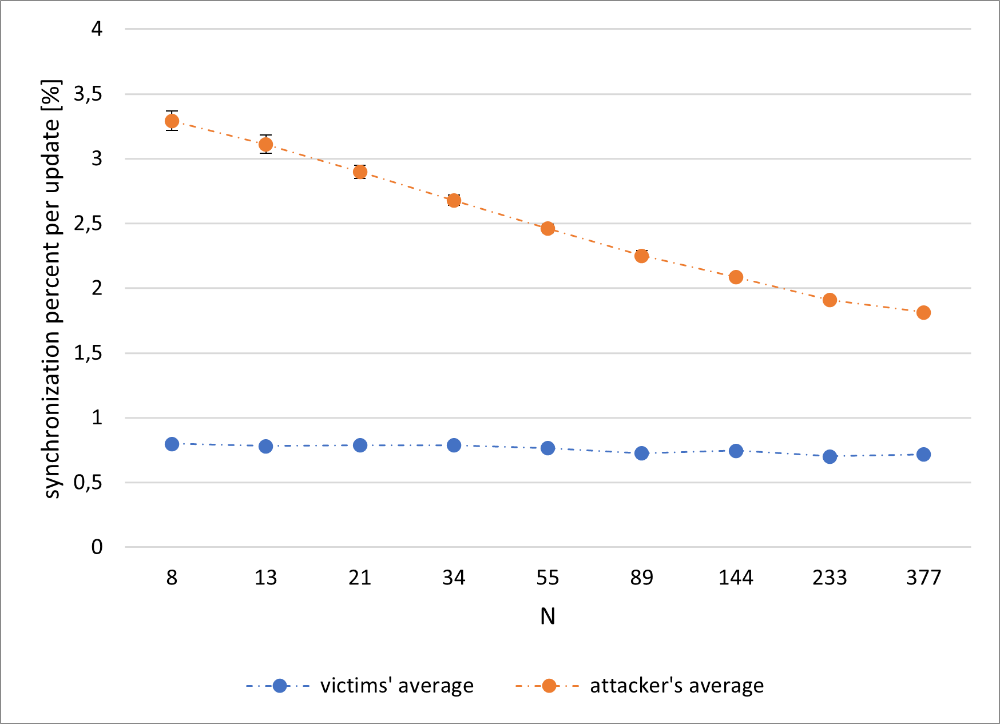
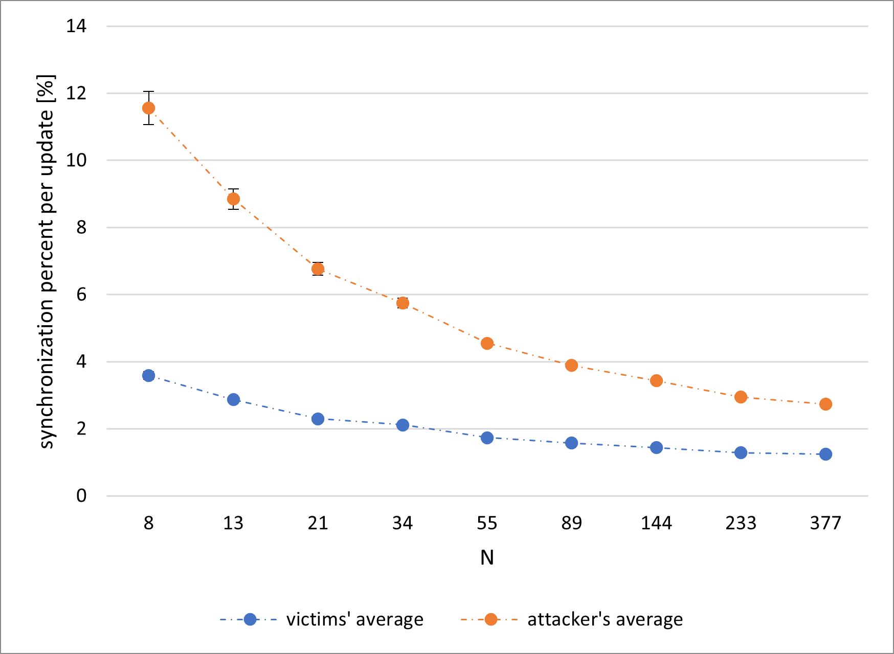
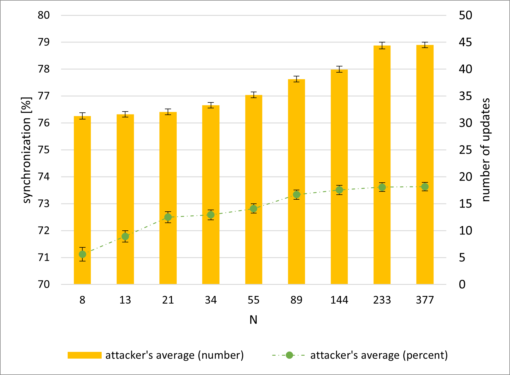

# Scenario 2 results for `K` = `5`:
## explanation for abbreviations in tables:
| ***abbreviation***      | ***explanation***                                     |
|:-----------------------:|:-----------------------------------------------------:|
| ***`U_V`***             | average number of updates between victims             |
| ***`E``X`*** | average $\pm$ error value for the column `X`          |
| ***`S`***               | average percent of attacker's synchronization         |
| ***`U_A`***             | average number of attacker's updates                  |
| ***`P_V`***             | average victims' synchronization percent per update   |
| ***`P_A`***             | average attacker's synchronization percent per update |

## hebbian, random keys:
### table with results \([legend](scenario_2_results_k5.md#explanation-for-abbreviations-in-tables)\):
| ***`N`*** | ***`U_V`*** | ***`E``U_V`*** | ***`S`*** | ***`E``S`*** | ***`U_A`*** | ***`E``U_A`*** | ***`P_V`*** | ***`E``P_V`*** | ***`P_A`*** | ***`E``P_A`*** |
|-----------|-------------|---------------------------|-----------|-------------------------|-------------|---------------------------|-------------|---------------------------|-------------|---------------------------|
| 8         | 143.36      | 3.63                      | 68.3      | 0.3                     | 25.21       | 0.68                      | 0.799       | 0.016                     | 3.293       | 0.074                     |
| 13        | 143.39      | 2.72                      | 69.81     | 0.24                    | 27.9        | 0.48                      | 0.781       | 0.015                     | 3.112       | 0.069                     |
| 21        | 146.12      | 2.5                       | 70.5      | 0.24                    | 28.33       | 0.46                      | 0.787       | 0.014                     | 2.899       | 0.052                     |
| 34        | 146.92      | 2.27                      | 71.52     | 0.22                    | 29.75       | 0.44                      | 0.786       | 0.013                     | 2.679       | 0.041                     |
| 55        | 147.73      | 2.24                      | 72.01     | 0.19                    | 32.2        | 0.45                      | 0.765       | 0.012                     | 2.461       | 0.035                     |
| 89        | 150.45      | 2.25                      | 72.3      | 0.19                    | 35.36       | 0.49                      | 0.726       | 0.011                     | 2.255       | 0.034                     |
| 144       | 150.95      | 2.44                      | 72.73     | 0.18                    | 38.45       | 0.55                      | 0.748       | 0.011                     | 2.086       | 0.03                      |
| 233       | 156.26      | 2.32                      | 72.76     | 0.18                    | 41.49       | 0.57                      | 0.706       | 0.01                      | 1.911       | 0.025                     |
| 377       | 170.7       | 1.86                      | 73.2      | 0.17                    | 43.11       | 0.49                      | 0.718       | 0.009                     | 1.815       | 0.022                     |
### Synchronization percent per update

### Attacker's synchronization and updates

## hebbian, `QBER` = `3%`:
### table with results \([legend](scenario_2_results_k5.md#explanation-for-abbreviations-in-tables)\):
| ***`N`*** | ***`U_V`*** | ***`E``U_V`*** | ***`S`*** | ***`E``S`*** | ***`U_A`*** | ***`E``U_A`*** | ***`P_V`*** | ***`E``P_V`*** | ***`P_A`*** | ***`E``P_A`*** |
|-----------|-------------|---------------------------|-----------|-------------------------|-------------|---------------------------|-------------|---------------------------|-------------|---------------------------|
| 8         | 50.24       | 1.99                      | 67.05     | 0.29                    | 10.68       | 0.37                      | 3.164       | 0.103                     | 10.283      | 0.415                     |
| 13        | 50.69       | 1.55                      | 69.32     | 0.24                    | 11.59       | 0.31                      | 2.769       | 0.07                      | 8.269       | 0.254                     |
| 21        | 56.72       | 1.56                      | 70.2      | 0.21                    | 13.57       | 0.32                      | 2.38        | 0.061                     | 7.035       | 0.236                     |
| 34        | 65.03       | 1.69                      | 71.33     | 0.22                    | 16.29       | 0.36                      | 1.982       | 0.043                     | 5.515       | 0.137                     |
| 55        | 71.61       | 1.88                      | 71.73     | 0.19                    | 18.87       | 0.4                       | 1.781       | 0.038                     | 4.688       | 0.104                     |
| 89        | 72.2        | 2.01                      | 72.22     | 0.18                    | 23.15       | 0.46                      | 1.528       | 0.032                     | 3.741       | 0.075                     |
| 144       | 84.38       | 1.93                      | 72.38     | 0.19                    | 24.27       | 0.49                      | 1.504       | 0.028                     | 3.314       | 0.065                     |
| 233       | 89.61       | 1.87                      | 73.09     | 0.19                    | 26.03       | 0.48                      | 1.378       | 0.025                     | 3.257       | 0.055                     |
| 377       | 90.07       | 1                         | 73.43     | 0.17                    | 27.81       | 0.29                      | 1.34        | 0.02                      | 3.049       | 0.044                     |
### Synchronization percent per update

### Attacker's synchronization and updates

## hebbian, `QBER` = `5%`:
### table with results \([legend](scenario_2_results_k5.md#explanation-for-abbreviations-in-tables)\):
| ***`N`*** | ***`U_V`*** | ***`E``U_V`*** | ***`S`*** | ***`E``S`*** | ***`U_A`*** | ***`E``U_A`*** | ***`P_V`*** | ***`E``P_V`*** | ***`P_A`*** | ***`E``P_A`*** |
|-----------|-------------|---------------------------|-----------|-------------------------|-------------|---------------------------|-------------|---------------------------|-------------|---------------------------|
| 8         | 49.19       | 2.08                      | 67.54     | 0.28                    | 10.73       | 0.4                       | 3.264       | 0.096                     | 10.442      | 0.417                     |
| 13        | 47.75       | 1.56                      | 68.9      | 0.26                    | 10.72       | 0.3                       | 3.037       | 0.088                     | 9.327       | 0.359                     |
| 21        | 57.37       | 1.52                      | 69.88     | 0.22                    | 13.44       | 0.32                      | 2.34        | 0.06                      | 6.946       | 0.194                     |
| 34        | 65.85       | 1.76                      | 71.06     | 0.22                    | 16.4        | 0.37                      | 1.981       | 0.046                     | 5.516       | 0.132                     |
| 55        | 72.74       | 1.9                       | 71.91     | 0.19                    | 19.49       | 0.42                      | 1.773       | 0.038                     | 4.477       | 0.089                     |
| 89        | 80.33       | 1.99                      | 72.49     | 0.18                    | 22.43       | 0.45                      | 1.586       | 0.032                     | 3.876       | 0.076                     |
| 144       | 84.83       | 1.88                      | 72.59     | 0.19                    | 25.23       | 0.48                      | 1.435       | 0.027                     | 3.381       | 0.061                     |
| 233       | 92.71       | 2.05                      | 72.76     | 0.18                    | 28.4        | 0.53                      | 1.332       | 0.026                     | 3.008       | 0.055                     |
| 377       | 93.95       | 1.76                      | 73.5      | 0.17                    | 30.31       | 0.47                      | 1.257       | 0.023                     | 2.734       | 0.044                     |
### Synchronization percent per update

### Attacker's synchronization and updates

## hebbian, `QBER` = `7%`:
### table with results \([legend](scenario_2_results_k5.md#explanation-for-abbreviations-in-tables)\):
| ***`N`*** | ***`U_V`*** | ***`E``U_V`*** | ***`S`*** | ***`E``S`*** | ***`U_A`*** | ***`E``U_A`*** | ***`P_V`*** | ***`E``P_V`*** | ***`P_A`*** | ***`E``P_A`*** |
|-----------|-------------|---------------------------|-----------|-------------------------|-------------|---------------------------|-------------|---------------------------|-------------|---------------------------|
| 8         | 45.37       | 1.73                      | 67.51     | 0.29                    | 9.86        | 0.33                      | 3.587       | 0.117                     | 11.566      | 0.491                     |
| 13        | 49.63       | 1.6                       | 68.96     | 0.24                    | 11.23       | 0.32                      | 2.876       | 0.077                     | 8.851       | 0.307                     |
| 21        | 57.05       | 1.59                      | 70.19     | 0.22                    | 13.79       | 0.34                      | 2,3         | 0.052                     | 6.767       | 0.19                      |
| 34        | 63.25       | 1.72                      | 71.04     | 0.2                     | 15.93       | 0.37                      | 2.117       | 0.051                     | 5.75        | 0.143                     |
| 55        | 71.91       | 1.68                      | 71.93     | 0.19                    | 18.83       | 0.36                      | 1.738       | 0.035                     | 4.554       | 0.091                     |
| 89        | 78.39       | 1.77                      | 72.34     | 0.19                    | 22.19       | 0.42                      | 1.573       | 0.031                     | 3.897       | 0.077                     |
| 144       | 86.45       | 1.95                      | 72.36     | 0.18                    | 25.47       | 0.5                       | 1.442       | 0.029                     | 3.433       | 0.072                     |
| 233       | 92.99       | 1.87                      | 72.77     | 0.19                    | 28.5        | 0.47                      | 1.285       | 0.024                     | 2.945       | 0.052                     |
| 377       | 96.65       | 1.93                      | 73.21     | 0.17                    | 30.71       | 0.52                      | 1.248       | 0.024                     | 2.736       | 0.047                     |
### Synchronization percent per update

### Attacker's synchronization and updates

## randomwalk, random keys:
### table with results \([legend](scenario_2_results_k5.md#explanation-for-abbreviations-in-tables)\):
| ***`N`*** | ***`U_V`*** | ***`E``U_V`*** | ***`S`*** | ***`E``S`*** | ***`U_A`*** | ***`E``U_A`*** | ***`P_V`*** | ***`E``P_V`*** | ***`P_A`*** | ***`E``P_A`*** |
|-----------|-------------|---------------------------|-----------|-------------------------|-------------|---------------------------|-------------|---------------------------|-------------|---------------------------|
| 8         | 154.98      | 3.6                       | 71.12     | 0.26                    | 31.3        | 0.6                       | 0.622       | 0.013                     | 2.731       | 0.06                      |
| 13        | 155.4       | 3.19                      | 71.79     | 0.21                    | 31.6        | 0.54                      | 0.656       | 0.012                     | 2.67        | 0.05                      |
| 21        | 156.07      | 2.91                      | 72.5      | 0.21                    | 32.07       | 0.55                      | 0.689       | 0.012                     | 2.605       | 0.047                     |
| 34        | 158.99      | 2.57                      | 72.59     | 0.19                    | 33.29       | 0.52                      | 0.714       | 0.012                     | 2.459       | 0.041                     |
| 55        | 158.6       | 2.39                      | 72.82     | 0.17                    | 35.22       | 0.53                      | 0.719       | 0.011                     | 2.325       | 0.038                     |
| 89        | 162.7       | 2.39                      | 73.34     | 0.18                    | 38.15       | 0.55                      | 0.703       | 0.01                      | 2.125       | 0.031                     |
| 144       | 166.84      | 2.32                      | 73.51     | 0.17                    | 39.95       | 0.57                      | 0.721       | 0.011                     | 2.035       | 0.03                      |
| 233       | 177.73      | 2.44                      | 73.62     | 0.16                    | 44.38       | 0.63                      | 0.68        | 0.01                      | 1.82        | 0.025                     |
| 377       | 193.47      | 1.97                      | 73.64     | 0.16                    | 44.5        | 0.52                      | 0.698       | 0.009                     | 1.788       | 0.022                     |
### Synchronization percent per update

### Attacker's synchronization and updates

## randomwalk, `QBER` = `3%`:
### table with results \([legend](scenario_2_results_k5.md#explanation-for-abbreviations-in-tables)\):
| ***`N`*** | ***`U_V`*** | ***`E``U_V`*** | ***`S`*** | ***`E``S`*** | ***`U_A`*** | ***`E``U_A`*** | ***`P_V`*** | ***`E``P_V`*** | ***`P_A`*** | ***`E``P_A`*** |
|-----------|-------------|---------------------------|-----------|-------------------------|-------------|---------------------------|-------------|---------------------------|-------------|---------------------------|
| 8         | 83.9        | 3.05                      | 71.08     | 0.25                    | 18.36       | 0.6                       | 1.987       | 0.057                     | 6.784       | 0.279                     |
| 13        | 90.4        | 2.49                      | 71.48     | 0.22                    | 20.64       | 0.5                       | 1.88        | 0.069                     | 6.137       | 0.278                     |
| 21        | 91.49       | 2.3                       | 72.58     | 0.22                    | 20.83       | 0.49                      | 1.623       | 0.079                     | 4.862       | 0.171                     |
| 34        | 93.82       | 2.36                      | 72.56     | 0.19                    | 22.02       | 0.5                       | 1.459       | 0.036                     | 4.24        | 0.105                     |
| 55        | 96.95       | 2.34                      | 72.91     | 0.18                    | 24.08       | 0.53                      | 1.396       | 0.032                     | 3.805       | 0.087                     |
| 89        | 99.18       | 2.17                      | 73.12     | 0.19                    | 26.68       | 0.53                      | 1.307       | 0.03                      | 3.352       | 0.074                     |
| 144       | 99.49       | 2.23                      | 73.13     | 0.17                    | 28.84       | 0.57                      | 1.255       | 0.026                     | 3.044       | 0.061                     |
| 233       | 102.39      | 2.11                      | 73.58     | 0.17                    | 31.22       | 0.55                      | 1.191       | 0.024                     | 2.766       | 0.055                     |
| 377       | 100.08      | 1.81                      | 73.68     | 0.17                    | 31.95       | 0.48                      | 1.171       | 0.021                     | 2.585       | 0.042                     |
### Synchronization percent per update

### Attacker's synchronization and updates

## randomwalk, `QBER` = `5%`:
### table with results \([legend](scenario_2_results_k5.md#explanation-for-abbreviations-in-tables)\):
| ***`N`*** | ***`U_V`*** | ***`E``U_V`*** | ***`S`*** | ***`E``S`*** | ***`U_A`*** | ***`E``U_A`*** | ***`P_V`*** | ***`E``P_V`*** | ***`P_A`*** | ***`E``P_A`*** |
|-----------|-------------|---------------------------|-----------|-------------------------|-------------|---------------------------|-------------|---------------------------|-------------|---------------------------|
| 8         | 87.72       | 2.82                      | 71.6      | 0.26                    | 18.7        | 0.58                      | 1.784       | 0.078                     | 6.146       | 0.31                      |
| 13        | 87.74       | 2.38                      | 71.59     | 0.22                    | 19.57       | 0.45                      | 1.715       | 0.06                      | 5.609       | 0.228                     |
| 21        | 92.14       | 2.37                      | 72.24     | 0.2                     | 20.19       | 0.48                      | 1.628       | 0.048                     | 4.956       | 0.159                     |
| 34        | 93.04       | 2.44                      | 72.7      | 0.19                    | 22.66       | 0.51                      | 1.47        | 0.037                     | 4.154       | 0.106                     |
| 55        | 95.19       | 2.3                       | 72.7      | 0.18                    | 24.53       | 0.53                      | 1.387       | 0.033                     | 3.797       | 0.097                     |
| 89        | 97.39       | 2.14                      | 73.12     | 0.18                    | 27.24       | 0.52                      | 1.299       | 0.029                     | 3.255       | 0.07                      |
| 144       | 97.84       | 2.19                      | 73.32     | 0.18                    | 28.8        | 0.55                      | 1.271       | 0.026                     | 3.05        | 0.064                     |
| 233       | 103.18      | 2.3                       | 73.34     | 0.17                    | 31.14       | 0.58                      | 1.194       | 0.024                     | 2.749       | 0.049                     |
| 377       | 103.54      | 2.01                      | 73.63     | 0.17                    | 33.32       | 0.56                      | 1.156       | 0.022                     | 2.544       | 0.044                     |
### Synchronization percent per update

### Attacker's synchronization and updates

## randomwalk, `QBER` = `7%`:
### table with results \([legend](scenario_2_results_k5.md#explanation-for-abbreviations-in-tables)\):
| ***`N`*** | ***`U_V`*** | ***`E``U_V`*** | ***`S`*** | ***`E``S`*** | ***`U_A`*** | ***`E``U_A`*** | ***`P_V`*** | ***`E``P_V`*** | ***`P_A`*** | ***`E``P_A`*** |
|-----------|-------------|---------------------------|-----------|-------------------------|-------------|---------------------------|-------------|---------------------------|-------------|---------------------------|
| 8         | 88.98       | 2.92                      | 70.88     | 0.26                    | 19.1        | 0.55                      | 1.759       | 0.075                     | 6.028       | 0,3                       |
| 13        | 91.66       | 2.64                      | 71.76     | 0.22                    | 19.58       | 0.51                      | 1.653       | 0.054                     | 5.531       | 0.236                     |
| 21        | 92.43       | 2.61                      | 72.24     | 0.2                     | 20.82       | 0.55                      | 1.537       | 0.045                     | 4.919       | 0.15                      |
| 34        | 95.43       | 2.22                      | 72.78     | 0.19                    | 21.67       | 0.48                      | 1.528       | 0.04                      | 4.356       | 0.119                     |
| 55        | 95.76       | 2.16                      | 72.98     | 0.19                    | 24.88       | 0.5                       | 1.333       | 0.029                     | 3.58        | 0.078                     |
| 89        | 97.76       | 2.17                      | 73.03     | 0.18                    | 26.47       | 0.53                      | 1.324       | 0.029                     | 3.349       | 0.07                      |
| 144       | 99.61       | 2.22                      | 73.37     | 0.18                    | 29.08       | 0.54                      | 1.267       | 0.027                     | 3.049       | 0.065                     |
| 233       | 97.69       | 1.96                      | 73.59     | 0.17                    | 30.13       | 0.53                      | 1.232       | 0.023                     | 2.83        | 0.051                     |
| 377       | 98.42       | 1.81                      | 73.63     | 0.17                    | 31.66       | 0.49                      | 1.193       | 0.021                     | 2.637       | 0.044                     |
### Synchronization percent per update

### Attacker's synchronization and updates

