# Scenario 3 results:
## explanation for abbreviations in tables:
| ***abbreviation***      | ***explanation***                                     |
|:-----------------------:|:-----------------------------------------------------:|
| ***`U_V`***             | average number of updates between victims             |
| ***`E``X`*** | average $\pm$ error value for the column `X`          |
| ***`S`***               | average percent of attacker's synchronization         |
| ***`U_A`***             | average number of attacker's updates                  |
| ***`P_V`***             | average victims' synchronization percent per update   |
| ***`P_A`***             | average attacker's synchronization percent per update |

## hebbian, `K`,`N` ∈ `{3,4}`:
### table with results \([legend](scenario_3_results.md#explanation-for-abbreviations-in-tables)\):
| ***QBER***                |***X*** |***X*** |***3*** |***3*** |***5*** |***5*** |***7*** |***7*** |
|:-------------------------:|:------:|:------:|:------:|:------:|:------:|:------:|:------:|:------:|
| ***`K`,`N`***             | 3,4    | 4,3    | 3,4    | 4,3    | 3,4    | 4,3    | 3,4    | 4,3    |
| ***`U_V`***               | 195.09 | 544.81 | 13.51  | 19.25  | 13.25  | 18.38  | 12.48  | 18.36  |
| ***`E``U_V`*** | 8.67   | 21.2   | 0.62   | 0.87   | 0.56   | 0.81   | 0.52   | 0.89   |
| ***`S`***                 | 75.51  | 74.28  | 66.21  | 64.47  | 64.75  | 63.95  | 65.07  | 64.93  |
| ***`E``S`***   | 0.82   | 0.8    | 0.45   | 0.44   | 0.47   | 0.45   | 0.45   | 0.42   |
| ***`U_A`***               | 58.82  | 211.73 | 3.61   | 6.47   | 3.76   | 5.69   | 3.41   | 5.93   |
| ***`E``U_A`*** | 3.68   | 10.63  | 0.17   | 0.33   | 0.17   | 0.26   | 0.15   | 0.32   |
| ***`P_V`***               | 1.319  | 0.514  | 22.369 | 18.36  | 21.218 | 18.21  | 21.634 | 19.85  |
| ***`E``P_V`*** | 0.068  | 0.032  | 1.237  | 1.133  | 1.13   | 1.14   | 1.155  | 1.179  |
| ***`P_A`***               | 4.649  | 1.375  | 23.845 | 18.337 | 24.632 | 17.794 | 25.31  | 20.224 |
| ***`E``P_A`*** | 0.249  | 0.099  | 1.044  | 0.938  | 1.053  | 0.843  | 1.033  | 0.996  |
### Synchronization percent per update
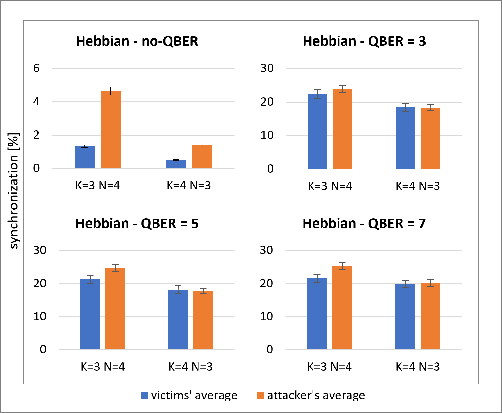
### Attacker's synchronization and updates
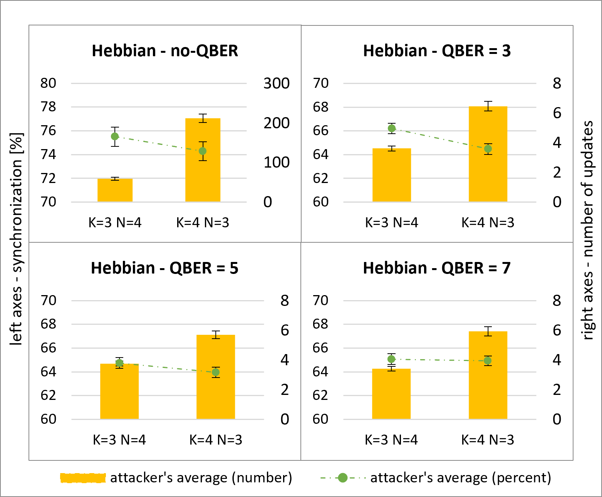

## randomwalk, `K`,`N` ∈ `{3,4}`:
### table with results \([legend](scenario_3_results.md#explanation-for-abbreviations-in-tables)\):
| ***QBER***                |***X***|***X*** |***3*** |***3*** |***5*** |***5*** |***7*** |***7*** |
|:-------------------------:|:-----:|:------:|:------:|:------:|:------:|:------:|:------:|:------:|
| ***`K`,`N`***             | 3,4   | 4,3    | 3,4    | 4,3    | 3,4    | 4,3    | 3,4    | 4,3    |
| ***`U_V`***               | 90.9  | 136.51 | 27.63  | 45.14  | 27.36  | 43.66  | 24.42  | 48.95  |
| ***`E``U_V`*** | 2     | 3.4    | 1.37   | 2.24   | 1.29   | 2.14   | 1.15   | 2.3    |
| ***`S`***                 | 73.55 | 70.95  | 70.82  | 69.91  | 70.6   | 69.56  | 71.07  | 69.52  |
| ***`E``S`***   | 0.51  | 0.45   | 0.46   | 0.44   | 0.46   | 0.46   | 0.48   | 0.42   |
| ***`U_A`***               | 17.51 | 30.7   | 6.92   | 12.91  | 7.26   | 12.4   | 6.38   | 13.73  |
| ***`E``U_A`*** | 0.45  | 0.84   | 0.35   | 0.65   | 0.35   | 0.6    | 0.31   | 0.64   |
| ***`P_V`***               | 1.429 | 1.02   | 17.016 | 13.277 | 13.896 | 12.91  | 15.474 | 11.101 |
| ***`E``P_V`*** | 0.04  | 0.032  | 1.156  | 1.082  | 1.019  | 1.041  | 1.005  | 0.848  |
| ***`P_A`***               | 5.859 | 3.467  | 21.195 | 14.687 | 19.811 | 15.339 | 22.539 | 16.066 |
| ***`E``P_A`*** | 0.186 | 0.168  | 1.037  | 0.862  | 0.921  | 0.87   | 1.005  | 0.929  |
### Synchronization percent per update

### Attacker's synchronization and updates
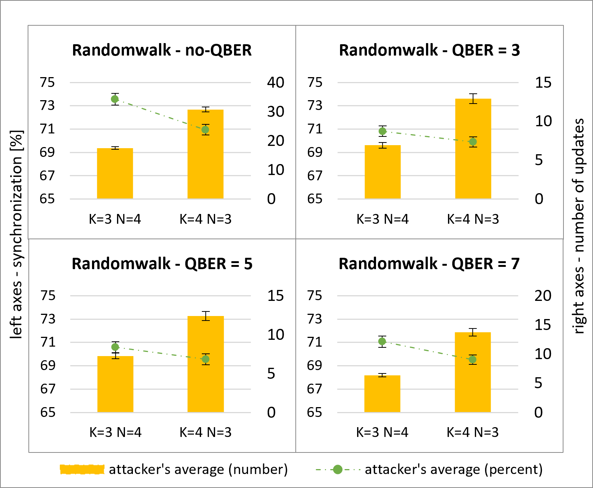

## hebbian, `K`,`N` ∈ `{4,5}`:
### table with results \([legend](scenario_3_results.md#explanation-for-abbreviations-in-tables)\):
| ***QBER***                | ***X***|***X*** |***3*** |***3*** |***5*** |***5*** |***7*** |***7*** |
|:-------------------------:|:------:|:------:|:------:|:------:|:------:|:------:|:------:|:------:|
| ***`K`,`N`***             | 4,5    | 5,4    | 4,5    | 5,4    | 4,5    | 5,4    | 4,5    | 5,4    |
| ***`U_V`***               | 191.69 | 360.71 | 40.17  | 64.08  | 38.19  | 60.64  | 35.59  | 57.06  |
| ***`E``U_V`*** | 6.02   | 12.72  | 2.68   | 5.42   | 2.34   | 5.38   | 2.23   | 4.25   |
| ***`S`***                 | 68.57  | 66.87  | 66.05  | 65.14  | 65.86  | 64.88  | 65.18  | 64.32  |
| ***`E``S`***   | 0.53   | 0.47   | 0.36   | 0.38   | 0.39   | 0.38   | 0.36   | 0.38   |
| ***`U_A`***               | 37.41  | 89.89  | 9.35   | 17.97  | 8.8    | 16.95  | 8.36   | 15.52  |
| ***`E``U_A`*** | 1.58   | 3.83   | 0.58   | 1.86   | 0.52   | 1.66   | 0.46   | 1.09   |
| ***`P_V`***               | 0.822  | 0.49   | 5.759  | 5.228  | 6.035  | 5.274  | 5.997  | 4.716  |
| ***`E``P_V`*** | 0.029  | 0.02   | 0.258  | 0.367  | 0.311  | 0.373  | 0.325  | 0.237  |
| ***`P_A`***               | 3.275  | 1.508  | 15.503 | 10.765 | 14.397 | 11.552 | 15.126 | 10.412 |
| ***`E``P_A`*** | 0.125  | 0.067  | 0.705  | 0.537  | 0.655  | 0.606  | 0.671  | 0.516  |
### Synchronization percent per update
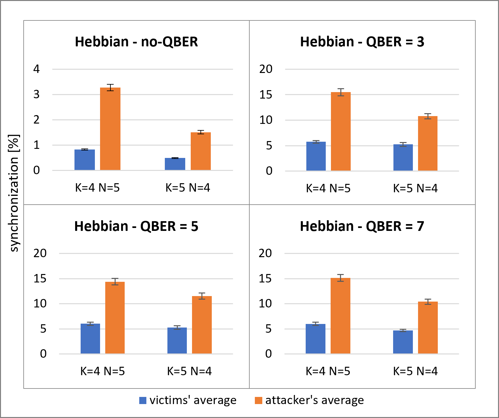
### Attacker's synchronization and updates
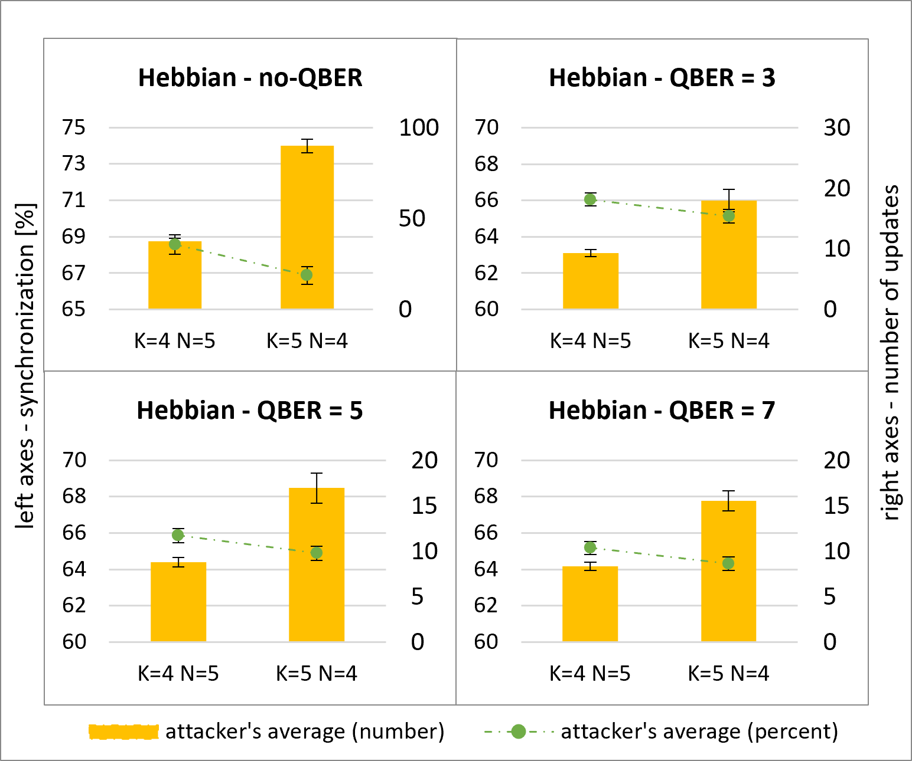

## randomwalk, `K`,`N` ∈ `{4,5}`:
### table with results \([legend](scenario_3_results.md#explanation-for-abbreviations-in-tables)\):
| ***QBER***                | ***X***|***X*** |***3***|***3*** |***5***|***5*** |***7***|***7***|
|:-------------------------:|:------:|:------:|:-----:|:------:|:-----:|:------:|:-----:|:-----:|
| ***`K`,`N`***             | 4,5    | 5,4    | 4,5   | 5,4    | 4,5   | 5,4    | 4,5   | 5,4   |
| ***`U_V`***               | 154.09 | 222.58 | 65.22 | 103.65 | 61.45 | 102.33 | 67.55 | 92.34 |
| ***`E``U_V`*** | 3.27   | 4.57   | 2.25  | 3.24   | 2.04  | 3.61   | 2.39  | 3.23  |
| ***`S`***                 | 71.06  | 70.73  | 70.8  | 69.89  | 71.09 | 69.69  | 70.39 | 69.43 |
| ***`E``S`***   | 0.35   | 0.34   | 0.33  | 0.32   | 0.35  | 0.32   | 0.36  | 0.32  |
| ***`U_A`***               | 27.04  | 45.86  | 14.42 | 26.23  | 13.48 | 25.93  | 15.04 | 23.48 |
| ***`E``U_A`*** | 0.59   | 1.01   | 0.5   | 0.81   | 0.44  | 0.91   | 0.53  | 0.81  |
| ***`P_V`***               | 0.846  | 0.567  | 3.855 | 2.252  | 3.521 | 2.468  | 3.353 | 2.986 |
| ***`E``P_V`*** | 0.026  | 0.015  | 0.343 | 0.244  | 0.283 | 0.173  | 0.217 | 0.35  |
| ***`P_A`***               | 3.469  | 2      | 9.887 | 5.319  | 9.541 | 6.924  | 9.404 | 6.624 |
| ***`E``P_A`*** | 0.108  | 0.057  | 0.56  | 0.373  | 0.476 | 0.48   | 0.523 | 0.423 |
### Synchronization percent per update
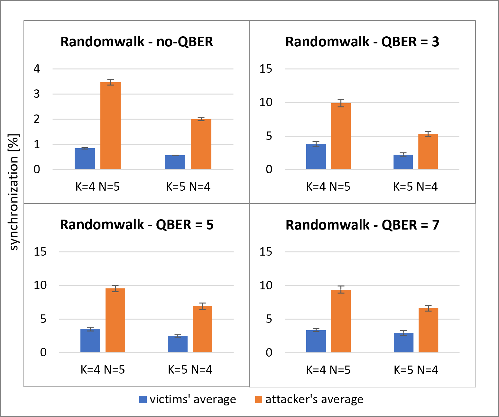
### Attacker's synchronization and updates
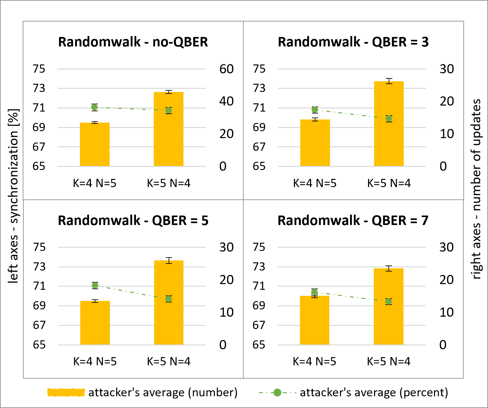

## hebbian, `K`,`N` ∈ `{5,6}`:
### table with results \([legend](scenario_3_results.md#explanation-for-abbreviations-in-tables)\):
| ***QBER***                | ***X***|***X***|***3*** |***3***|***5*** |***5***|***7*** |***7***|
|:-------------------------:|:------:|:-----:|:------:|:-----:|:------:|:-----:|:------:|:-----:|
| ***`K`,`N`***             | 5,6    | 6,5   | 5,6    | 6,5   | 5,6    | 6,5   | 5,6    | 6,5   |
| ***`U_V`***               | 208.68 | 329.3 | 44.32  | 67.88 | 43.34  | 71.48 | 42.77  | 62.25 |
| ***`E``U_V`*** | 5.02   | 8.33  | 2.13   | 4.09  | 2.12   | 4.36  | 1.88   | 3.8   |
| ***`S`***                 | 67.79  | 66.48 | 66.33  | 65.79 | 66.34  | 65.01 | 65.86  | 65.4  |
| ***`E``S`***   | 0.34   | 0.3   | 0.31   | 0.29  | 0.32   | 0.31  | 0.33   | 0.3   |
| ***`U_A`***               | 36     | 71.08 | 10.26  | 17.84 | 9.83   | 18.84 | 9.77   | 16.41 |
| ***`E``U_A`*** | 0.94   | 2.04  | 0.42   | 1.04  | 0.43   | 1.1   | 0.37   | 0.97  |
| ***`P_V`***               | 0.635  | 0.407 | 4.229  | 3.433 | 4.26   | 3.166 | 4.168  | 3.698 |
| ***`E``P_V`*** | 0.016  | 0.011 | 0.161  | 0.19  | 0.166  | 0.127 | 0.161  | 0.19  |
| ***`P_A`***               | 2.662  | 1.344 | 12.418 | 8.646 | 12.317 | 7.966 | 12.127 | 8.702 |
| ***`E``P_A`*** | 0.082  | 0.043 | 0.579  | 0.452 | 0.516  | 0.378 | 0.559  | 0.404 |
### Synchronization percent per update
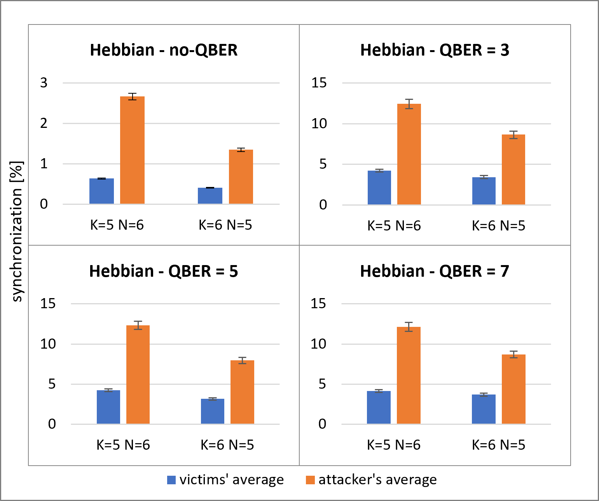
### Attacker's synchronization and updates
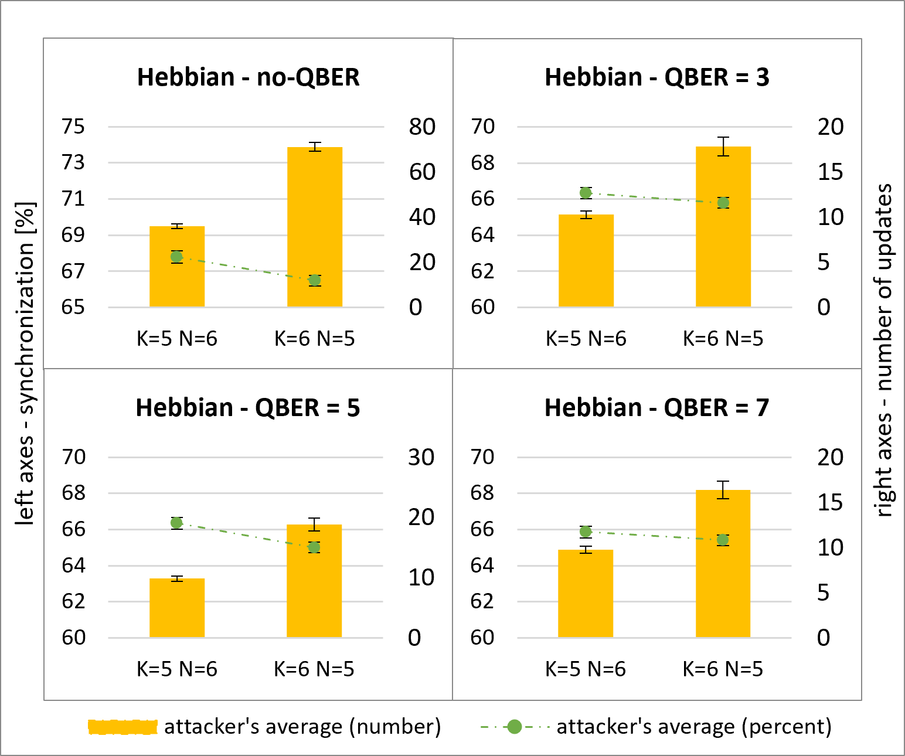

## randomwalk, `K`,`N` ∈ `{5,6}`:
### table with results \([legend](scenario_3_results.md#explanation-for-abbreviations-in-tables)\):
| ***QBER***                | ***X***|***X*** |***3***|***3*** |***5***|***5***|***7***|***7*** |
|:-------------------------:|:------:|:------:|:-----:|:------:|:-----:|:-----:|:-----:|:------:|
| ***`K`,`N`***             | 5,6    | 6,5    | 5,6   | 6,5    | 5,6   | 6,5   | 5,6   | 6,5    |
| ***`U_V`***               | 217.18 | 338.67 | 89.09 | 146.05 | 93.89 | 134.4 | 89.96 | 142.35 |
| ***`E``U_V`*** | 4.63   | 6.87   | 3.22  | 4.68   | 3.19  | 4.32  | 2.86  | 4.33   |
| ***`S`***                 | 70.83  | 69.84  | 70.47 | 69.53  | 69.97 | 69.06 | 70.33 | 69.68  |
| ***`E``S`***   | 0.29   | 0.27   | 0.29  | 0.28   | 0.28  | 0.28  | 0.29  | 0.28   |
| ***`U_A`***               | 37.14  | 67.14  | 19.62 | 36.69  | 20.38 | 33.4  | 20.05 | 35.2   |
| ***`E``U_A`*** | 0.81   | 1.39   | 0.67  | 1.14   | 0.65  | 1.02  | 0.63  | 1.03   |
| ***`P_V`***               | 0.579  | 0.372  | 2.19  | 1.527  | 2.241 | 1.566 | 2.136 | 1.368  |
| ***`E``P_V`*** | 0.014  | 0.011  | 0.102 | 0.132  | 0.173 | 0.107 | 0.12  | 0.076  |
| ***`P_A`***               | 2.451  | 1.342  | 6.969 | 3.937  | 6.228 | 4.222 | 6.829 | 3.923  |
| ***`E``P_A`*** | 0.062  | 0.044  | 0.37  | 0.274  | 0.339 | 0.278 | 0.384 | 0.277  |
### Synchronization percent per update
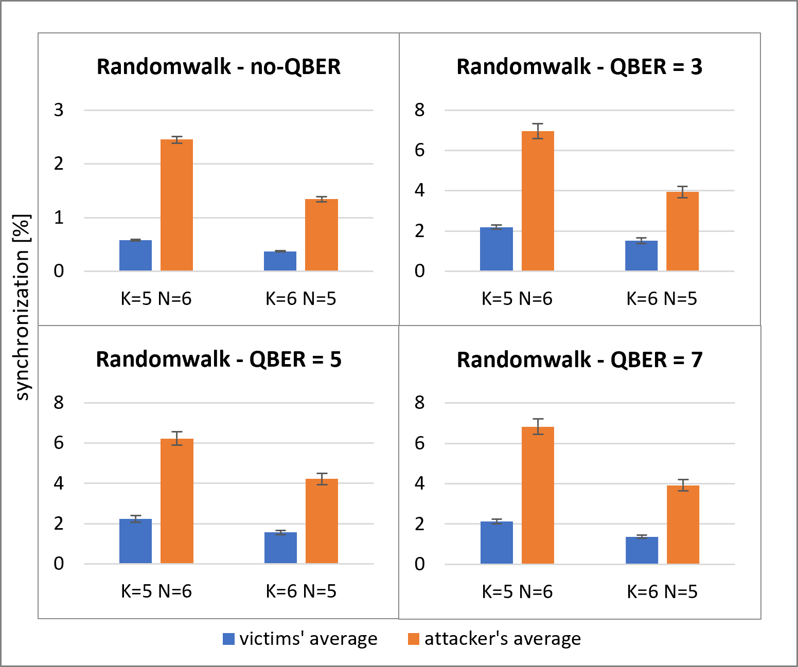
### Attacker's synchronization and updates
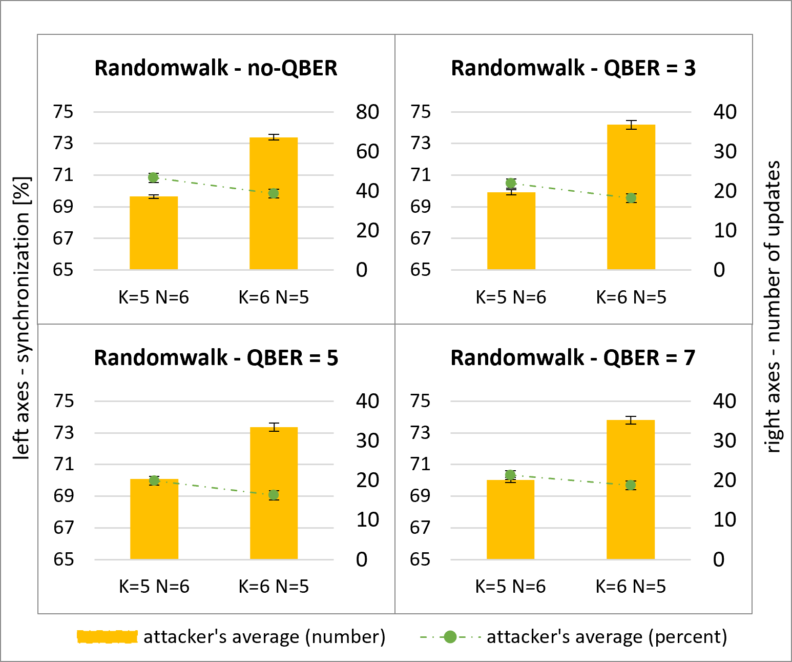
67
## hebbian, `K`,`N` ∈ `{6,7}`:
### table with results \([legend](scenario_3_results.md#explanation-for-abbreviations-in-tables)\):
| ***QBER***                | ***X***|***X*** |***3***|***3***|***5***|***5***|***7***|***7***|
|:-------------------------:|:------:|:------:|:-----:|:-----:|:-----:|:-----:|:-----:|:-----:|
| ***`K`,`N`***             | 6,7    | 7,6    | 6,7   | 7,6   | 6,7   | 7,6   | 6,7   | 7,6   |
| ***`U_V`***               | 230.54 | 318.23 | 61.57 | 91.44 | 63.77 | 83.27 | 62.88 | 84.37 |
| ***`E``U_V`*** | 4.6    | 5.83   | 2.68  | 4.01  | 3.01  | 3.73  | 2.99  | 4.32  |
| ***`S`***                 | 67.85  | 66.17  | 66.44 | 65.67 | 66.71 | 65.76 | 67.06 | 66.02 |
| ***`E``S`***   | 0.28   | 0.25   | 0.29  | 0.25  | 0.27  | 0.24  | 0.27  | 0.24  |
| ***`U_A`***               | 39.43  | 66.59  | 13.67 | 23.01 | 14.2  | 21.39 | 14.2  | 21.3  |
| ***`E``U_A`*** | 0.88   | 1.4    | 0.58  | 0.98  | 0.61  | 0.91  | 0.63  | 1.07  |
| ***`P_V`***               | 0.526  | 0.375  | 2.775 | 2.027 | 2.672 | 2.176 | 2.965 | 2.308 |
| ***`E``P_V`*** | 0.011  | 0.008  | 0.102 | 0.076 | 0.084 | 0.075 | 0.115 | 0.084 |
| ***`P_A`***               | 2.175  | 1.229  | 9.413 | 5.276 | 8.622 | 5.841 | 8.713 | 6.255 |
| ***`E``P_A`*** | 0.051  | 0.029  | 0.458 | 0.211 | 0.403 | 0.289 | 0.389 | 0.28  |
### Synchronization percent per update
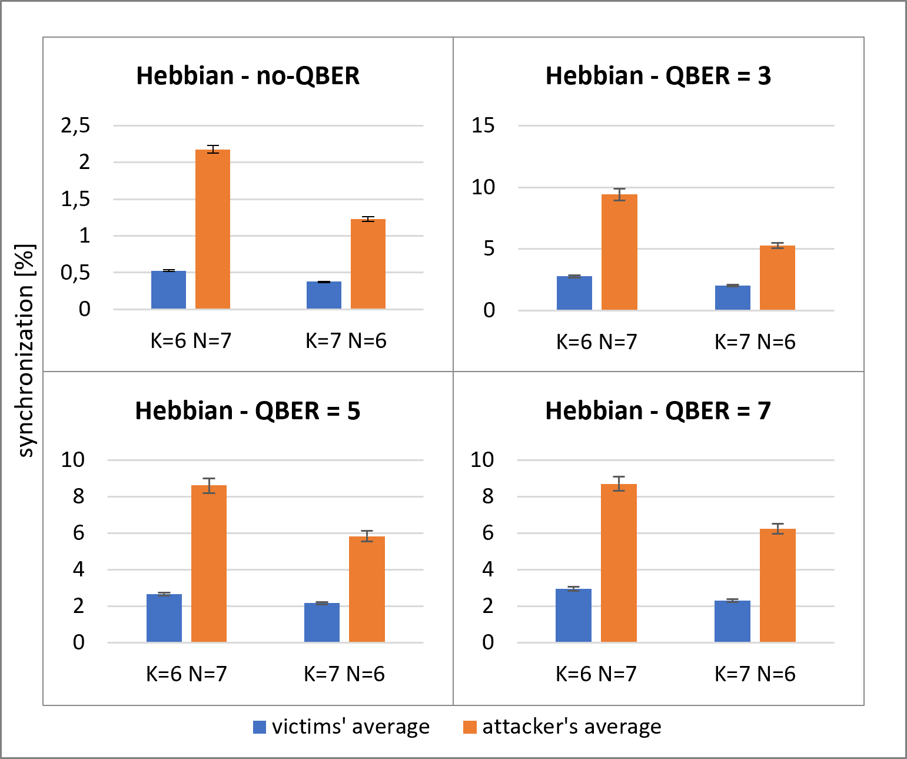
### Attacker's synchronization and updates
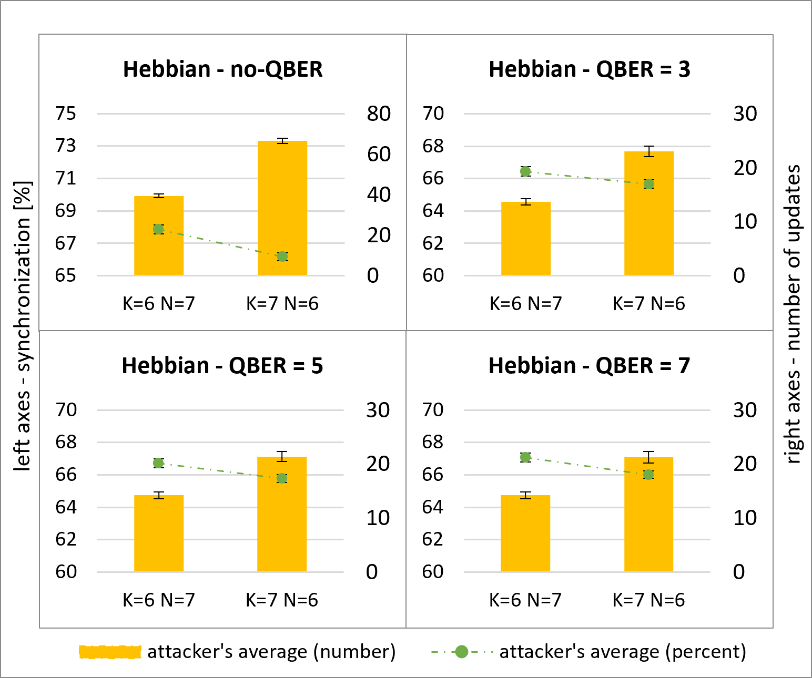

## randomwalk, `K`,`N` ∈ `{6,7}`:
### table with results \([legend](scenario_3_results.md#explanation-for-abbreviations-in-tables)\):
| ***QBER***                | ***X***|***X*** |***3*** |***3*** |***5*** |***5*** |***7*** |***7*** |
|:-------------------------:|:------:|:------:|:------:|:------:|:------:|:------:|:------:|:------:|
| ***`K`,`N`***             | 6,7    | 7,6    | 6,7    | 7,6    | 6,7    | 7,6    | 6,7    | 7,6    |
| ***`U_V`***               | 319.09 | 483.81 | 140.19 | 233.34 | 152.59 | 232.73 | 148.59 | 234.33 |
| ***`E``U_V`*** | 5.9    | 8.7    | 4.15   | 6.68   | 4.33   | 6.44   | 4.4    | 7.04   |
| ***`S`***                 | 70.74  | 69.48  | 70.34  | 69.34  | 70.06  | 69.54  | 70.37  | 69.19  |
| ***`E``S`***   | 0.24   | 0.23   | 0.24   | 0.23   | 0.25   | 0.23   | 0.24   | 0.24   |
| ***`U_A`***               | 55.22  | 97.15  | 29.94  | 55.55  | 32.24  | 56.66  | 31.91  | 55.89  |
| ***`E``U_A`*** | 1.03   | 1.79   | 0.83   | 1.55   | 0.85   | 1.54   | 0.88   | 1.63   |
| ***`P_V`***               | 0.372  | 0.247  | 1.19   | 0.81   | 1.171  | 0.72   | 1.165  | 0.752  |
| ***`E``P_V`*** | 0.007  | 0.005  | 0.054  | 0.049  | 0.069  | 0.038  | 0.064  | 0.039  |
| ***`P_A`***               | 1.536  | 0.866  | 3.993  | 2.47   | 3.8    | 2.102  | 3.538  | 2.2    |
| ***`E``P_A`*** | 0.034  | 0.02   | 0.234  | 0.188  | 0.237  | 0.158  | 0.155  | 0.154  |
### Synchronization percent per update
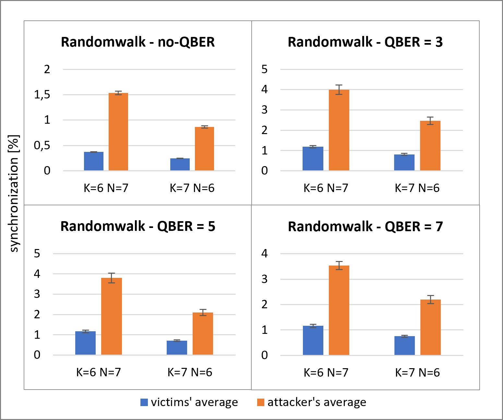
### Attacker's synchronization and updates
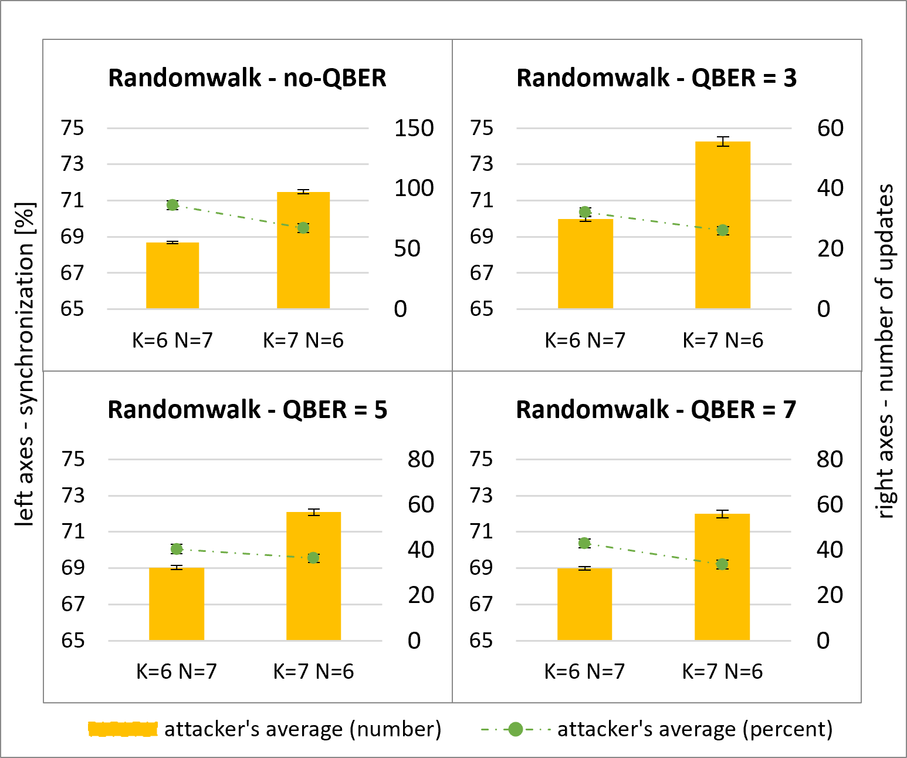
78
## hebbian, `K`,`N` ∈ `{7,8}`:
### table with results \([legend](scenario_3_results.md#explanation-for-abbreviations-in-tables)\):
| ***QBER***                | ***X***|***X*** |***3***|***3***|***5***|***5*** |***7***|***7*** |
|:-------------------------:|:------:|:------:|:-----:|:-----:|:-----:|:------:|:-----:|:------:|
| ***`K`,`N`***             | 7,8    | 8,7    | 7,8   | 8,7   | 7,8   | 8,7    | 7,8   | 8,7    |
| ***`U_V`***               | 258.17 | 336.03 | 82.06 | 93.05 | 76.18 | 102.54 | 73.92 | 101.88 |
| ***`E``U_V`*** | 4.65   | 5.39   | 3.36  | 3.75  | 2.64  | 4.33   | 2.72  | 4.12   |
| ***`S`***                 | 67.38  | 66.54  | 66.49 | 66.28 | 67.1  | 66.33  | 66.96 | 66.47  |
| ***`E``S`***   | 0.25   | 0.22   | 0.23  | 0.24  | 0.22  | 0.22   | 0.23  | 0.23   |
| ***`U_A`***               | 45.24  | 69.27  | 18.05 | 23.91 | 16.66 | 25.63  | 16.26 | 25.82  |
| ***`E``U_A`*** | 0.91   | 1.26   | 0.7   | 0.94  | 0.55  | 1.07   | 0.55  | 1.03   |
| ***`P_V`***               | 0.455  | 0.342  | 2.115 | 1.82  | 2.05  | 1.747  | 2.102 | 1.703  |
| ***`E``P_V`*** | 0.009  | 0.006  | 0.072 | 0.057 | 0.061 | 0.059  | 0.06  | 0.062  |
| ***`P_A`***               | 1.822  | 1.137  | 6.434 | 4.814 | 6.772 | 4.854  | 6.634 | 4.599  |
| ***`E``P_A`*** | 0.04   | 0.023  | 0.275 | 0.202 | 0.307 | 0.222  | 0.278 | 0.214  |
### Synchronization percent per update
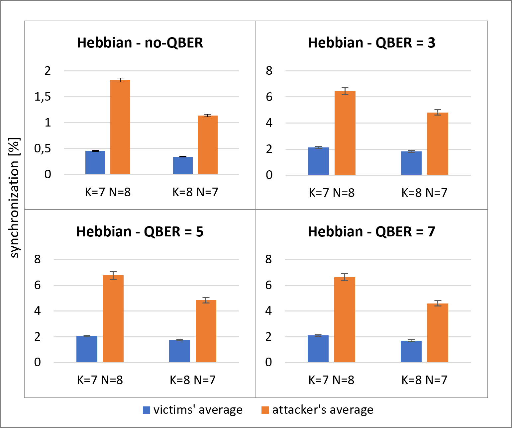
### Attacker's synchronization and updates
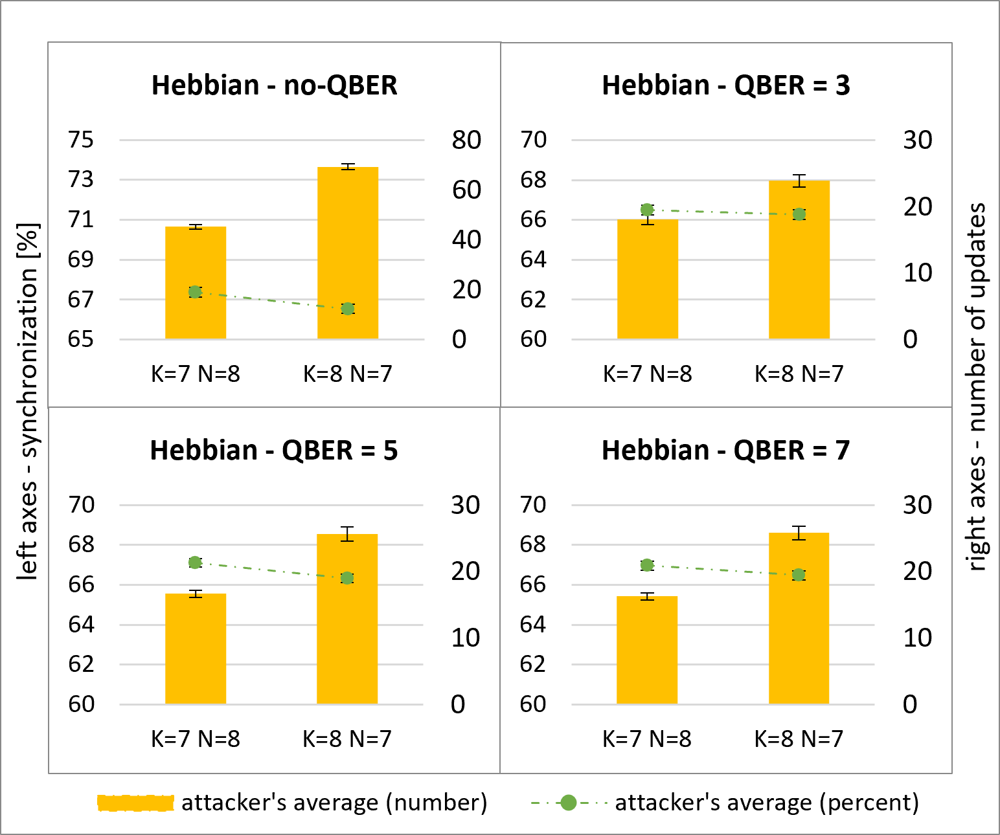

## randomwalk, `K`,`N` ∈ `{7,8}`:
### table with results \([legend](scenario_3_results.md#explanation-for-abbreviations-in-tables)\):
| ***QBER***                | ***X***|***X*** |***3*** |***3*** |***5*** |***5*** |***7*** |***7*** |
|:-------------------------:|:------:|:------:|:------:|:------:|:------:|:------:|:------:|:------:|
| ***`K`,`N`***             | 7,8    | 8,7    | 7,8    | 8,7    | 7,8    | 8,7    | 7,8    | 8,7    |
| ***`U_V`***               | 426.24 | 643.67 | 210.11 | 335.45 | 220.95 | 327.61 | 219.18 | 343.28 |
| ***`E``U_V`*** | 7.89   | 10.74  | 5.66   | 8.79   | 6.16   | 8.66   | 6.3    | 9.38   |
| ***`S`***                 | 70.12  | 69.55  | 69.89  | 69.48  | 70.12  | 69.57  | 70.18  | 69.57  |
| ***`E``S`***   | 0.23   | 0.22   | 0.22   | 0.21   | 0.22   | 0.21   | 0.23   | 0.22   |
| ***`U_A`***               | 74.43  | 130.26 | 43.68  | 79.36  | 45.67  | 77.74  | 45.81  | 81.11  |
| ***`E``U_A`*** | 1.4    | 2.2    | 1.13   | 2.04   | 1.18   | 1.98   | 1.25   | 2.15   |
| ***`P_V`***               | 0.285  | 0.182  | 0.803  | 0.5    | 0.766  | 0.47   | 0.751  | 0.478  |
| ***`E``P_V`*** | 0.007  | 0.004  | 0.036  | 0.029  | 0.035  | 0.021  | 0.035  | 0.022  |
| ***`P_A`***               | 1.15   | 0.636  | 2.666  | 1.421  | 2.543  | 1.404  | 2.418  | 1.357  |
| ***`E``P_A`*** | 0.026  | 0.015  | 0.129  | 0.071  | 0.127  | 0.082  | 0.104  | 0.067  |
### Synchronization percent per update
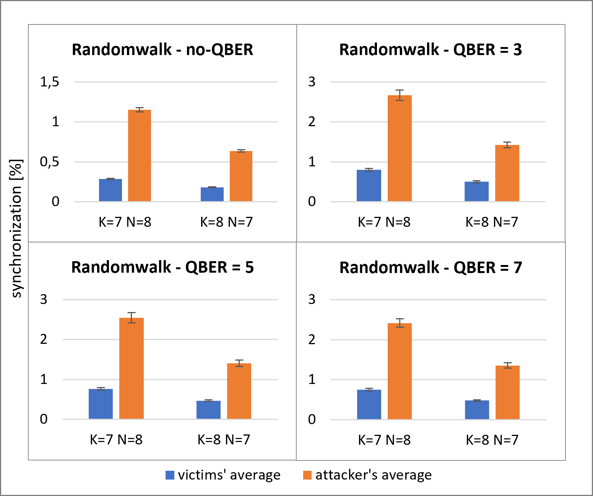
### Attacker's synchronization and updates
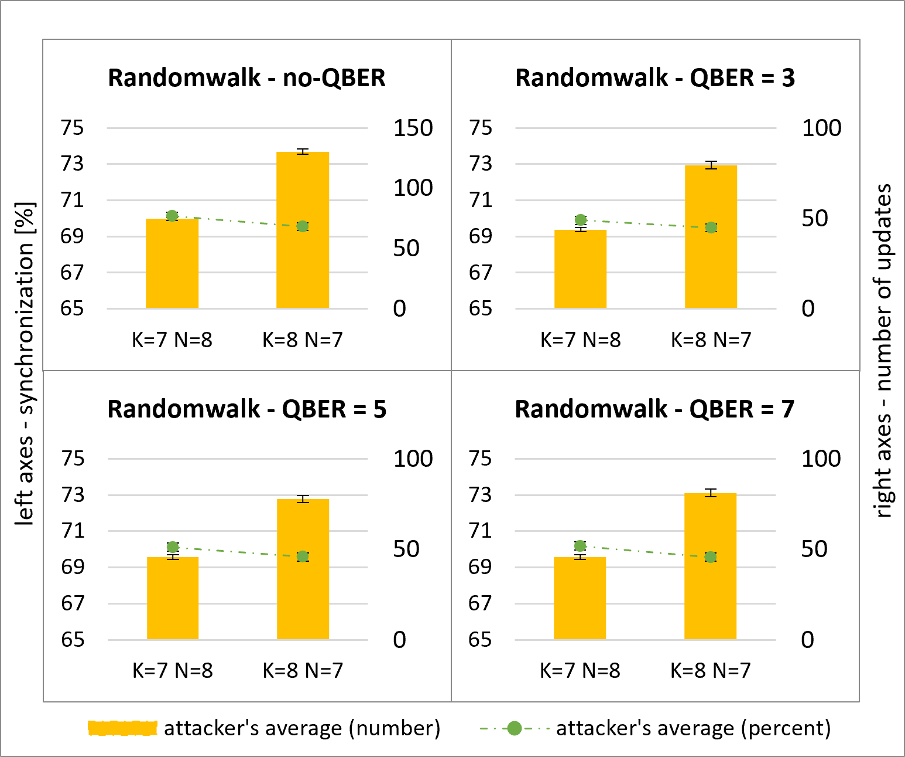
89
## hebbian, `K`,`N` ∈ `{8,9}`:
### table with results \([legend](scenario_3_results.md#explanation-for-abbreviations-in-tables)\):
| ***QBER***                | ***X***|***X*** |***3***|***3*** |***5***|***5*** |***7***|***7*** |
|:-------------------------:|:------:|:------:|:-----:|:------:|:-----:|:------:|:-----:|:------:|
| ***`K`,`N`***             | 8,9    | 9,8    | 8,9   | 9,8    | 8,9   | 9,8    | 8,9   | 9,8    |
| ***`U_V`***               | 281.01 | 355.44 | 88.12 | 116.86 | 90.78 | 114.63 | 92.01 | 117.08 |
| ***`E``U_V`*** | 4.64   | 6.08   | 3.44  | 4.08   | 3.05  | 3.95   | 3.34  | 4.3    |
| ***`S`***                 | 67.39  | 66.84  | 67.18 | 66.58  | 67.4  | 66.75  | 67.5  | 66.65  |
| ***`E``S`***   | 0.21   | 0.21   | 0.21  | 0.2    | 0.21  | 0.2    | 0.2   | 0.21   |
| ***`U_A`***               | 50.09  | 73.89  | 19.99 | 30.05  | 20.13 | 29.03  | 20.82 | 29.1   |
| ***`E``U_A`*** | 0.9    | 1.42   | 0.73  | 1.03   | 0.66  | 1      | 0.73  | 1.06   |
| ***`P_V`***               | 0.408  | 0.324  | 1.814 | 1.377  | 1.675 | 1.386  | 1.77  | 1.372  |
| ***`E``P_V`*** | 0.007  | 0.006  | 0.059 | 0.042  | 0.049 | 0.045  | 0.06  | 0.041  |
| ***`P_A`***               | 1.584  | 1.087  | 5.513 | 3.706  | 5.248 | 3.666  | 5.505 | 3.739  |
| ***`E``P_A`*** | 0.031  | 0.024  | 0.242 | 0.171  | 0.18  | 0.136  | 0.236 | 0.13   |
### Synchronization percent per update
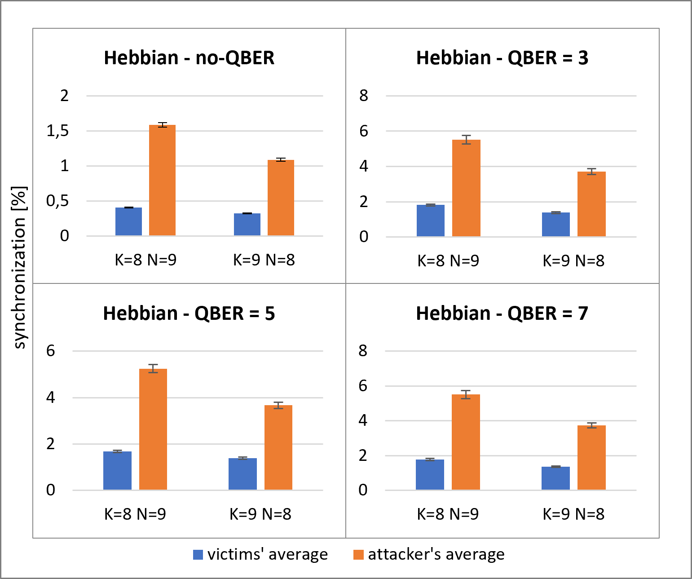
### Attacker's synchronization and updates
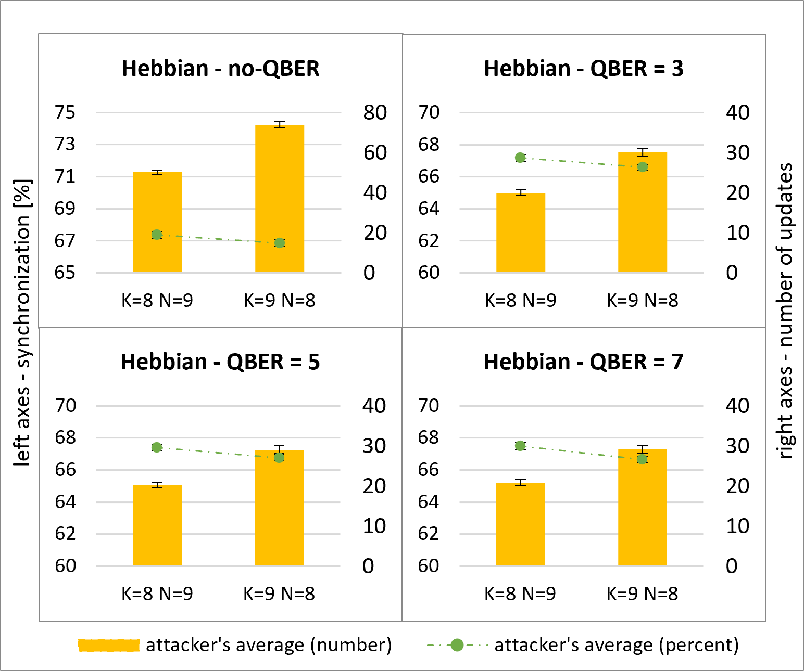

## randomwalk, `K`,`N` ∈ `{8,9}`:
### table with results \([legend](scenario_3_results.md#explanation-for-abbreviations-in-tables)\):
| ***QBER***                | ***X***|***X*** |***3*** |***3*** |***5***|***5*** |***7*** |***7*** |
|:-------------------------:|:------:|:------:|:------:|:------:|:-----:|:------:|:------:|:------:|
| ***`K`,`N`***             | 8,9    | 9,8    | 8,9    | 9,8    | 8,9   | 9,8    | 8,9    | 9,8    |
| ***`U_V`***               | 584.3  | 891.66 | 314.33 | 490.51 | 308.8 | 491.63 | 317.88 | 466.9  |
| ***`E``U_V`*** | 9.65   | 14.57  | 8.16   | 12.33  | 8.42  | 11.96  | 8.49   | 10.67  |
| ***`S`***                 | 70.16  | 69.02  | 69.84  | 69.36  | 69.95 | 69.45  | 70.01  | 69.06  |
| ***`E``S`***   | 0.2    | 0.2    | 0.19   | 0.21   | 0.2   | 0.2    | 0.2    | 0.2    |
| ***`U_A`***               | 103.45 | 181.86 | 64.97  | 116.13 | 64.84 | 116.17 | 65.81  | 109.64 |
| ***`E``U_A`*** | 1.76   | 3.04   | 1.55   | 2.79   | 1.66  | 2.65   | 1.67   | 2.44   |
| ***`P_V`***               | 0.198  | 0.13   | 0.478  | 0.33   | 0.509 | 0.304  | 0.499  | 0.332  |
| ***`E``P_V`*** | 0.004  | 0.002  | 0.021  | 0.022  | 0.02  | 0.013  | 0.02   | 0.022  |
| ***`P_A`***               | 0.798  | 0.445  | 1.605  | 0.936  | 1.629 | 0.874  | 1.659  | 0.906  |
| ***`E``P_A`*** | 0.017  | 0.009  | 0.09   | 0.074  | 0.066 | 0.042  | 0.069  | 0.041  |
### Synchronization percent per update
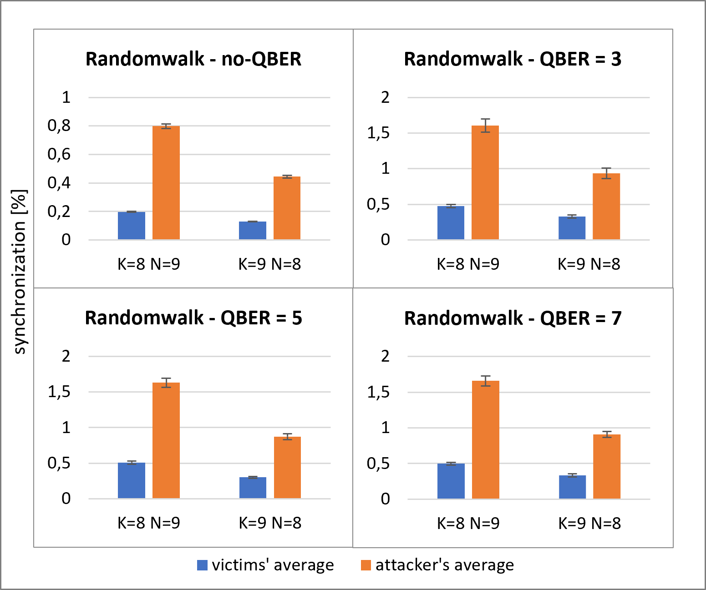
### Attacker's synchronization and updates
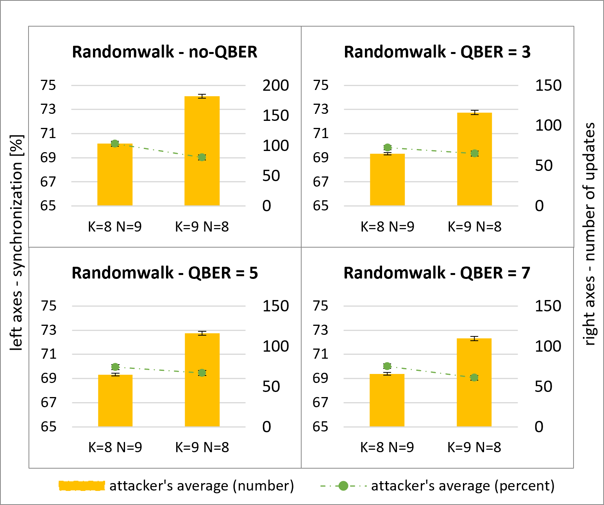
910
## hebbian, `K`,`N` ∈ `{9,10}`:
### table with results \([legend](scenario_3_results.md#explanation-for-abbreviations-in-tables)\):
| ***QBER***                | ***X***|***X*** |***3*** |***3*** |***5*** |***5*** |***7*** |***7*** |
|:-------------------------:|:------:|:------:|:------:|:------:|:------:|:------:|:------:|:------:|
| ***`K`,`N`***             | 9,10   | 10,9   | 9,10   | 10,9   | 9,10   | 10,9   | 9,10   | 10,9   |
| ***`U_V`***               | 307.77 | 376.25 | 119.16 | 141.35 | 127.05 | 145.91 | 119.43 | 141.19 |
| ***`E``U_V`*** | 4.46   | 5.39   | 3.83   | 4.46   | 4.05   | 4.89   | 3.58   | 4.19   |
| ***`S`***                 | 67.68  | 67.04  | 67.44  | 66.89  | 67.51  | 66.84  | 67.26  | 66.78  |
| ***`E``S`***   | 0.19   | 0.19   | 0.19   | 0.19   | 0.19   | 0.19   | 0.18   | 0.17   |
| ***`U_A`***               | 56.48  | 79.12  | 26.67  | 35.69  | 27.88  | 36.4   | 26.68  | 35.63  |
| ***`E``U_A`*** | 0.93   | 1.26   | 0.8    | 1.13   | 0.88   | 1.19   | 0.76   | 1.06   |
| ***`P_V`***               | 0.361  | 0.296  | 1.298  | 1.074  | 1.212  | 1.068  | 1.239  | 1.073  |
| ***`E``P_V`*** | 0.006  | 0.005  | 0.04   | 0.031  | 0.037  | 0.034  | 0.036  | 0.033  |
| ***`P_A`***               | 1.376  | 0.965  | 3.88   | 2.933  | 3.798  | 2.862  | 3.653  | 2.877  |
| ***`E``P_A`*** | 0.026  | 0.017  | 0.132  | 0.109  | 0.127  | 0.097  | 0.107  | 0.108  |
### Synchronization percent per update
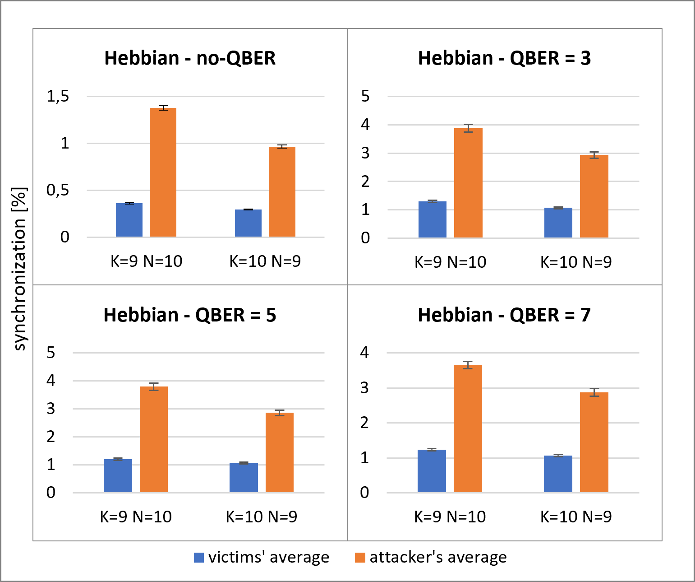
### Attacker's synchronization and updates
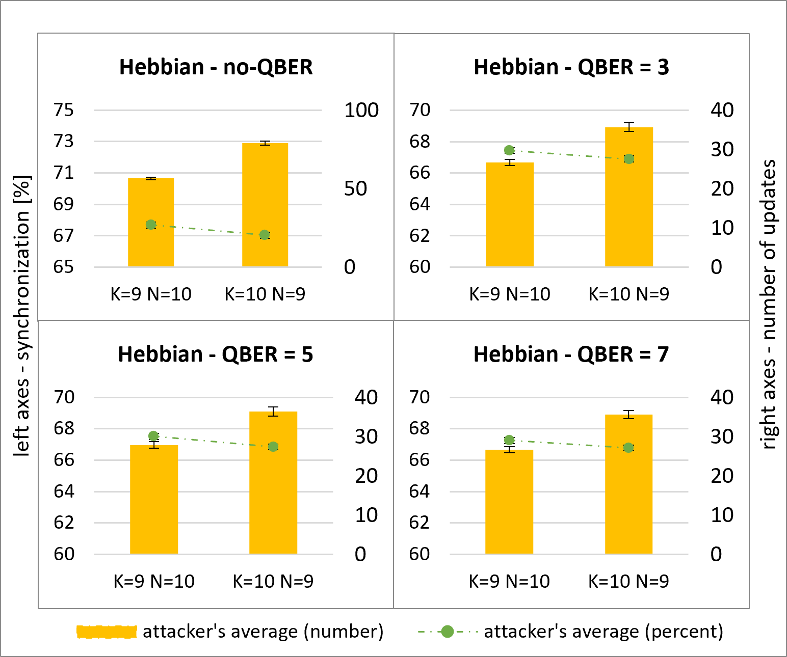

## randomwalk, `K`,`N` ∈ `{9,10}`:
### table with results \([legend](scenario_3_results.md#explanation-for-abbreviations-in-tables)\):
| ***QBER***                | ***X***| ***X*** |***3*** |***3*** |***5*** |***5*** |***7*** |***7*** |
|:-------------------------:|:------:|:-------:|:------:|:------:|:------:|:------:|:------:|:------:|
| ***`K`,`N`***             | 9,10   | 10,9    | 9,10   | 10,9   | 9,10   | 10,9   | 9,10   | 10,9   |
| ***`U_V`***               | 766.4  | 1188.57 | 467.91 | 720.3  | 447.34 | 713.59 | 477.49 | 706.96 |
| ***`E``U_V`*** | 12.52  | 18.31   | 11.3   | 15.3   | 10.68  | 15.74  | 10.77  | 15.35  |
| ***`S`***                 | 69.62  | 69.47   | 69.78  | 69.22  | 69.79  | 69.44  | 69.64  | 69.15  |
| ***`E``S`***   | 0.18   | 0.18    | 0.19   | 0.19   | 0.18   | 0.17   | 0.18   | 0.18   |
| ***`U_A`***               | 138.58 | 247.68  | 96.05  | 168.82 | 92.27  | 167.3  | 99.32  | 166.82 |
| ***`E``U_A`*** | 2.33   | 3.85    | 2.15   | 3.5    | 2.09   | 3.58   | 2.11   | 3.45   |
| ***`P_V`***               | 0.151  | 0.095   | 0.308  | 0.196  | 0.334  | 0.195  | 0.297  | 0.211  |
| ***`E``P_V`*** | 0.003  | 0.002   | 0.011  | 0.011  | 0.014  | 0.007  | 0.012  | 0.017  |
| ***`P_A`***               | 0.592  | 0.317   | 0.983  | 0.582  | 1.088  | 0.57   | 0.963  | 0.654  |
| ***`E``P_A`*** | 0.013  | 0.005   | 0.03   | 0.039  | 0.043  | 0.022  | 0.039  | 0.081  |
### Synchronization percent per update
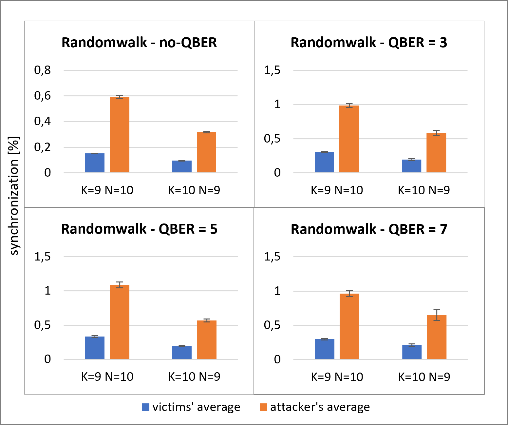
### Attacker's synchronization and updates
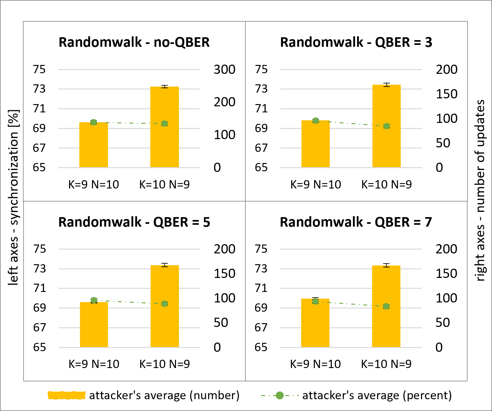

